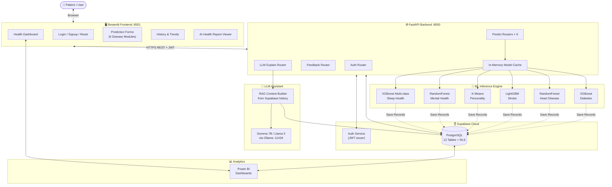
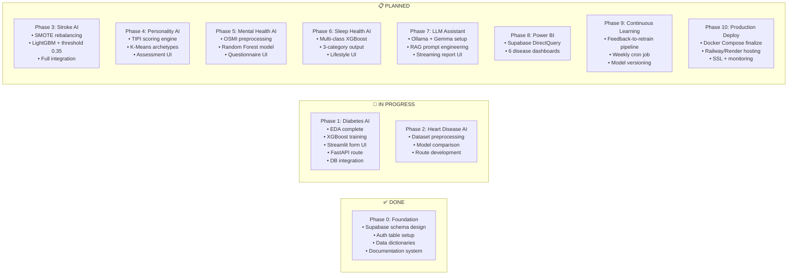

# 🏥 HealthAI India — Documentation Portal

> **Building an AI-Powered Preventive Healthcare Platform**

 A modular healthcare AI platform capable of predicting 6 health conditions, storing user-consented records in Supabase, and continuously improving through user feedback.

---

## 🗺️ Documentation Navigation

| Document | Description |
|:---|:---|
| **[PRD.md](PRD.md)** | Product goals, user personas, journey maps, Gantt roadmap, KPIs |
| **[TRD.md](TRD.md)** | System architecture, C4 diagrams, sequence diagrams, API specs |
| **[THEORY.md](THEORY.md)** | Full ML theory, class diagrams, ERD, library reference, event models |
| **[USAGE_DEPLOYMENT.md](USAGE_DEPLOYMENT.md)** | Local setup, Docker, CI/CD, Railway/Render deployment |
| **[AI_Diabetes.md](AI_Diabetes.md)** | Diabetes Prediction — XGBoost, PIMA dataset, SQL schema |
| **[AI_HeartDisease.md](AI_HeartDisease.md)** | Heart Disease — Random Forest, Cleveland dataset, SQL schema |
| **[AI_Stroke.md](AI_Stroke.md)** | Stroke Prediction — LightGBM + SMOTE, threshold 0.35 |
| **[AI_Personality.md](AI_Personality.md)** | OCEAN Personality — TIPI scoring, K-Means archetypes |
| **[AI_MentalHealth.md](AI_MentalHealth.md)** | Mental Health — OSMI dataset, Random Forest |
| **[AI_SleepHealth.md](AI_SleepHealth.md)** | Sleep Disorders — Multi-class XGBoost, 3 disorder categories |

---

## 🗂️ Complete Repository Treeview

```text
HealthAI/
│
├── 📁 backend/                          # FastAPI Application Server
│   ├── main.py                          # App entry point, CORS, router registration
│   ├── database.py                      # Supabase client + SupabaseSyncManager class
│   ├── dependencies.py                  # JWT auth dependency: get_current_user()
│   ├── config.py                        # Settings (env vars via pydantic BaseSettings)
│   ├── requirements.txt                 # Python dependencies
│   │
│   ├── 📁 routes/                       # Modular FastAPI APIRouters
│   │   ├── auth.py                      # POST /auth/login, /auth/register, /auth/refresh
│   │   ├── diabetes.py                  # POST /predict/diabetes, GET /history/diabetes
│   │   ├── heart.py                     # POST /predict/heart
│   │   ├── stroke.py                    # POST /predict/stroke
│   │   ├── personality.py               # POST /predict/personality
│   │   ├── mental.py                    # POST /predict/mental
│   │   ├── sleep.py                     # POST /predict/sleep
│   │   ├── feedback.py                  # POST /feedback
│   │   └── llm.py                       # POST /explain (LLM streaming)
│   │
│   ├── 📁 schemas/                      # Pydantic Request/Response Models
│   │   ├── diabetes_schema.py
│   │   ├── heart_schema.py
│   │   ├── stroke_schema.py
│   │   ├── personality_schema.py
│   │   ├── mental_schema.py
│   │   └── sleep_schema.py
│   │
│   ├── 📁 pipelines/                    # ML Pipeline classes (BaseModelPipeline + children)
│   │   ├── base.py                      # Abstract BaseModelPipeline
│   │   ├── diabetes_pipeline.py
│   │   ├── heart_pipeline.py
│   │   ├── stroke_pipeline.py
│   │   ├── personality_pipeline.py
│   │   ├── mental_pipeline.py
│   │   └── sleep_pipeline.py
│   │
│   └── 📁 tests/                        # Unit & Integration Tests
│       ├── test_auth.py
│       ├── test_diabetes.py
│       └── test_heart.py
│
├── 📁 frontend/                         # Streamlit Web Client
│   ├── app.py                           # Main router with st.navigation / st.sidebar
│   ├── auth_ui.py                       # Login, signup, password reset pages
│   ├── config.py                        # FASTAPI_URL, Supabase client setup
│   ├── requirements.txt
│   │
│   ├── 📁 pages/                        # Streamlit multi-page structure
│   │   ├── 01_Dashboard.py              # Overview health summary
│   │   ├── 02_Diabetes.py               # Diabetes prediction form
│   │   ├── 03_Heart.py                  # Heart disease prediction form
│   │   ├── 04_Stroke.py                 # Stroke prediction form
│   │   ├── 05_Personality.py            # OCEAN personality assessment
│   │   ├── 06_Mental_Health.py          # Mental health questionnaire
│   │   ├── 07_Sleep.py                  # Sleep health assessment
│   │   └── 08_History.py                # Prediction history & Power BI embed
│   │
│   └── 📁 components/                   # Reusable Streamlit UI widgets
│       ├── prediction_card.py           # Risk card with gauge chart
│       ├── history_chart.py             # Historical trend Plotly chart
│       └── sidebar.py                   # Navigation + user info sidebar
│
├── 📁 database/                         # Supabase SQL Migrations
│   ├── 01_users.sql                     # users + user_profiles tables
│   ├── 02_predictions.sql               # global predictions table
│   ├── 03_disease_records.sql           # All 6 disease record tables
│   ├── 04_feedback.sql                  # feedback + consent_logs tables
│   └── 05_rls_policies.sql              # All Row Level Security policies
│
├── 📁 models/                           # Trained ML Model Binaries
│   ├── 📁 diabetes/
│   │   ├── diabetes_model.pkl           # XGBClassifier
│   │   └── diabetes_scaler.pkl          # MinMaxScaler
│   ├── 📁 heart/
│   │   ├── heart_model.pkl              # RandomForestClassifier
│   │   └── heart_scaler.pkl             # StandardScaler
│   ├── 📁 stroke/
│   │   ├── stroke_model.pkl             # LGBMClassifier
│   │   └── stroke_scaler.pkl            # StandardScaler
│   ├── 📁 personality/
│   │   └── personality_kmeans.pkl       # KMeans (k=4)
│   ├── 📁 mental_health/
│   │   ├── mental_model.pkl             # RandomForestClassifier
│   │   └── mental_encoder.pkl           # LabelEncoder
│   └── 📁 sleep/
│       ├── sleep_model.pkl              # XGBClassifier (multi-class)
│       └── sleep_scaler.pkl             # StandardScaler
│
├── 📁 datasets/                         # Source Datasets & Notebooks
│   ├── 📁 diabetes/
│   │   ├── pima_diabetes.csv
│   │   └── diabetes_eda.ipynb
│   ├── 📁 heart/
│   │   ├── cleveland_heart.csv
│   │   └── heart_eda.ipynb
│   ├── 📁 stroke/
│   │   ├── stroke_data.csv
│   │   └── stroke_eda.ipynb
│   ├── 📁 personality/
│   │   └── tipi_data.csv
│   ├── 📁 mental_health/
│   │   └── osmi_survey.csv
│   └── 📁 sleep/
│       └── sleep_lifestyle.csv
│
├── 📁 docs/                             # This documentation folder
│   ├── README.md                        # ← You are here
│   ├── PRD.md
│   ├── TRD.md
│   ├── THEORY.md
│   ├── USAGE_DEPLOYMENT.md
│   ├── AI_Diabetes.md
│   ├── AI_HeartDisease.md
│   ├── AI_Stroke.md
│   ├── AI_Personality.md
│   ├── AI_MentalHealth.md
│   └── AI_SleepHealth.md
│
├── .env                                 # Environment variables (gitignored)
├── .gitignore
├── docker-compose.yml                   # Multi-container orchestration
├── README.md                            # Root project README
└── idea.md                              # Original project roadmap document
```

---

## 🎨 High-Level Architecture Diagram



---

## 📋 Kanban Board — Current Development Status



> [!NOTE]
> Each phase follows the **Incremental Integration Approach** — every model must complete training → API route → Streamlit UI → Supabase integration → testing before moving to the next phase.

> [!TIP]
> Model `.pkl` files are committed to Git using **Git LFS** to track binary files efficiently.
# HealthCare-Model

