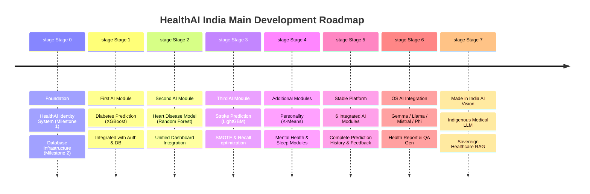
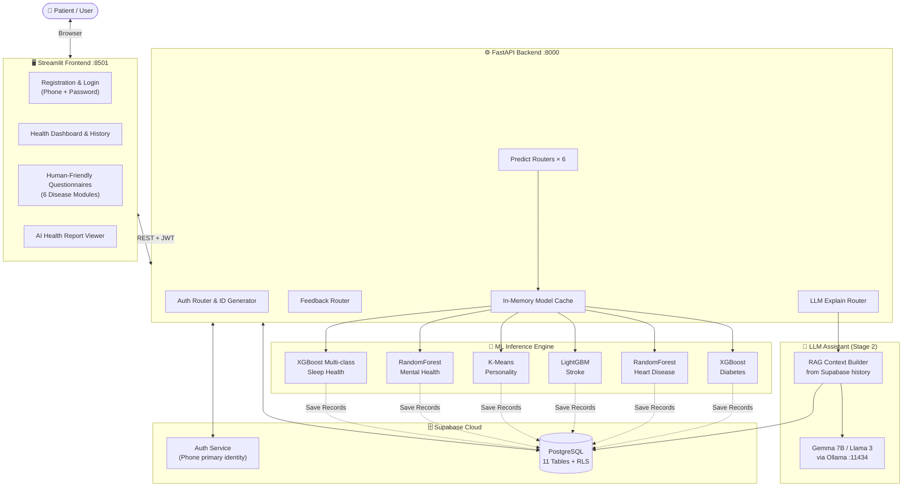

# 🏥 HealthAI India — Made in India Healthcare AI Ecosystem

> **Building an Indigenous, Secure, and Modular Preventive Healthcare AI Platform**

HealthAI India is an indigenous AI-powered healthcare platform developed in India with the long-term vision of becoming a **Made in India Healthcare AI Ecosystem**. By combining a secure geographical identity framework (HealthAI ID) with clinical-grade machine learning models, HealthAI India shifts the paradigm from curative to preventive healthcare.

---

## 🗺️ Documentation Navigation

| Document | Description |
|:---|:---|
| **[PRD.md](docs/PRD.md)** | Product Requirements Document: Goals, registration flow, questionnaires, user journeys, progress tracker, KPIs |
| **[TRD.md](docs/TRD.md)** | Technical Requirements Document: Architecture (C4), database schemas, HealthAI ID algorithm, API contracts |
| **[THEORY.md](docs/THEORY.md)** | Scientific Foundation: Mathematical models, OOP pipelines, data flow, ML theories |
| **[USAGE_DEPLOYMENT.md](docs/USAGE_DEPLOYMENT.md)** | Engineering Operations: Local installation, Docker orchestration, testing pipeline, cloud deployment |
| **[Idea.md](docs/Idea.md)** | Core Concept: Overall vision, problem statement, long-term roadmap |
| **[AI_Diabetes.md](docs/AI_Diabetes.md)** | Diabetes Module: XGBoost classifier, feature maps, schemas |
| **[AI_HeartDisease.md](docs/AI_HeartDisease.md)** | Heart Disease Module: Random Forest classifier, feature maps, schemas |
| **[AI_Stroke.md](docs/docs/AI_Stroke.md)** | Stroke Module: LightGBM + SMOTE, custom classification threshold |
| **[AI_Personality.md](docs/AI_Personality.md)** | Personality Module: TIPI metrics, K-Means clustering |
| **[AI_MentalHealth.md](docs/AI_MentalHealth.md)** | Mental Health Module: OSMI survey, Random Forest classification |
| **[AI_SleepHealth.md](docs/AI_SleepHealth.md)** | Sleep Disorders Module: Multi-class XGBoost model, lifestyle vectors |

---

## 🚩 Executive Development Roadmap

This high-level roadmap outlines the development plan of HealthAI India from Day 1 to the long-term sovereign AI stack.



### 🚩 Stage 0 — Foundation
* **Milestone 1 — HealthAI Identity System**: Prior to any machine learning, the platform designs the secure HealthAI Identity System. This includes State, District, and City codes, creating a permanent unique HealthAI ID format (e.g. `WB-01-0001-XXXXX`). The custom backend generation algorithm will be built separately.
* **Milestone 2 — Database Infrastructure**: Configure Supabase PostgreSQL schema with tables: `users`, `user_profiles`, `predictions`, `feedback`, `consent_logs`, and disease-specific records. Users can register (geographical path to phone verification), login (phone number + password only), and view their dashboard. No prediction modules are present.

### 🚩 Stage 1 — First AI Module
* **Diabetes Prediction System**: Train the XGBoost model using the PIMA dataset. Clean, perform EDA, and evaluate. Integrate it with the existing authentication and database infrastructure.
* **Release v1.0.0**: `HealthAI Authentication` + `Supabase` + `Diabetes AI`.

### 🚩 Stage 2 — Second AI Module
* **Heart Disease Model**: Train a Random Forest model on the Cleveland clinic dataset. Test and integrate into the main platform.
* **Release v2.0.0**: `HealthAI Authentication` + `Supabase` + `Diabetes` + `Heart Disease`.

### 🚩 Stage 3 — Third AI Module
* **Stroke Prediction**: Train a LightGBM model utilizing SMOTE to address class imbalance. Optimize the threshold to 0.35 for high recall.
* **Release v3.0.0**: `HealthAI Authentication` + `Supabase` + `Diabetes` + `Heart Disease` + `Stroke`.

### 🚩 Stage 4 — Additional AI Modules
* Perform the same incremental strategy for `Personality`, `Mental Health`, and `Sleep Health`. Each finished module is immediately merged and deployed to production.

### 🚩 Stage 5 — Complete Healthcare Platform
* Stable Release containing: Authentication, HealthAI ID, Diabetes, Heart Disease, Stroke, Personality, Mental Health, Sleep Health, Prediction History, User Dashboard, and Feedback System.

### 🚩 Stage 6 — Open Source AI Integration
* Enhance the stable platform with fine-tuned open-source models (Gemma, Llama, Mistral, Phi) to generate plain-language risk explanations, health reports, and answer user queries. These models complement, rather than replace, traditional ML models.

### 🚩 Stage 7 — Made in India AI Vision (Long-Term Research Vision)
* Build the sovereign Indian Healthcare AI Ecosystem: Indigenous Medical LLMs, Indian Medical Knowledge Bases, Indian Clinical Guidelines (ICMR/NHP), multi-lingual support for major Indian languages, and local data/AI infrastructure.

---

## 🗂️ Repository Structure

```text
HealthAI/
├── backend/                          # FastAPI application server
│   ├── main.py                       # App entry point, CORS, router registration
│   ├── database.py                   # Supabase client + sync manager
│   ├── dependencies.py               # JWT auth dependency (Phone number based)
│   ├── config.py                     # Settings (env vars via pydantic BaseSettings)
│   ├── requirements.txt              # Python dependencies
│   ├── routes/                       # Modular FastAPI routers
│   │   ├── auth.py                   # POST /auth/login, /auth/register
│   │   ├── diabetes.py               # POST /predict/diabetes, GET /history/diabetes
│   │   ├── heart.py                  # POST /predict/heart
│   │   ├── stroke.py                 # POST /predict/stroke
│   │   ├── personality.py            # POST /predict/personality
│   │   ├── mental.py                 # POST /predict/mental
│   │   ├── sleep.py                  # POST /predict/sleep
│   │   ├── feedback.py               # POST /feedback
│   │   └── llm.py                    # POST /explain (LLM streaming)
│   ├── schemas/                      # Pydantic request/response models
│   └── pipelines/                    # ML pipeline classes
├── frontend/                         # Streamlit web client
│   ├── app.py                        # Main router with st.navigation / st.sidebar
│   ├── auth_ui.py                    # Phone-number based Signup and Login UI
│   ├── config.py                     # API client configurations
│   ├── pages/                        # Streamlit multi-page structure
│   └── components/                   # Reusable Streamlit UI widgets
├── database/                         # Supabase SQL migrations
│   ├── 01_users.sql                  # users + user_profiles tables
│   ├── 02_predictions.sql            # predictions + consent_logs tables
│   ├── 03_disease_records.sql        # All 6 disease record tables
│   ├── 04_feedback.sql               # feedback table
│   └── 05_rls_policies.sql           # Row Level Security policies
├── models/                           # Trained ML model binaries (Git LFS)
├── datasets/                         # Source datasets and notebooks
└── docs/                             # Project documentation (Idea, PRD, TRD, THEORY, etc.)
```

---

## 🎨 High-Level Architecture



> [!NOTE]
> Each stage follows the **Incremental Integration Approach** — every model must complete training → API route → Streamlit UI → Supabase integration → testing before moving to the next phase.
