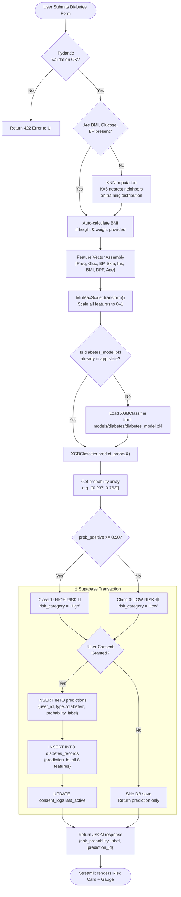

# 🩺 Diabetes Prediction AI — Complete Model Specification

**Model**: XGBoost Binary Classifier | **Dataset**: PIMA Indians Diabetes | **Target**: Diabetic (1) / Non-Diabetic (0)

---

## 📋 1. Model Overview

The Diabetes AI is the **first and foundational model** in the HealthAI India platform. It identifies early-stage diabetes risk using 8 physiological indicators from the PIMA Indians Diabetes dataset (sourced from the National Institute of Diabetes and Digestive and Kidney Diseases).

### Clinical Significance
- **Diabetes affects 101 million Indians** (IDF 2023)
- Early detection reduces complication risk by 40-60%
- BMI and Glucose are the two strongest predictors (feature importance > 0.20 each)

---

## 📊 2. Feature Data Dictionary

| Feature Name | Type | Clinical Description | Normal Range | Source in UI |
|:---|:---:|:---|:---:|:---|
| `Pregnancies` | Integer | Times pregnant (endocrine stress indicator) | 0–17 | Slider / 0 if male |
| `Glucose` | Float | 2-hour plasma glucose (oral glucose tolerance test) | 70–140 mg/dL | Manual entry |
| `BloodPressure` | Float | Diastolic blood pressure at rest | 60–90 mm Hg | Manual entry |
| `SkinThickness` | Float | Triceps skinfold thickness (body fat proxy) | 10–50 mm | Optional input |
| `Insulin` | Float | 2-hour serum insulin | 16–166 µU/mL | Optional input |
| `BMI` | Float | Body Mass Index (auto-calculated) | 18.5–30 | height + weight inputs |
| `DiabetesPedigree` | Float | Family history genetic risk score (0.0–2.5) | < 0.5 low risk | Select family history |
| `Age` | Integer | Patient age | 21–81 | Slider |

**BMI Auto-Calculation**:

$$BMI = \frac{weight_{kg}}{height_m^2}$$

---

## 🔬 3. Dataset Profile & Exploratory Analysis

| Property | Value |
|:---|:---|
| Source Dataset | PIMA Indians Diabetes (UCI ML Repository) |
| Total Samples | 768 rows |
| Positive Class (Diabetic) | 268 (34.9%) |
| Negative Class (Non-Diabetic) | 500 (65.1%) |
| Missing Values | ~375 zero-imputed cells in Glucose, BP, Skin, Insulin, BMI |
| Train Split | 80% (614 samples) |
| Test Split | 20% (154 samples) |
| Stratified | Yes |

**Key Finding**: Zero values in Glucose, BMI, Insulin, SkinThickness, BloodPressure are biologically impossible and are treated as missing → imputed via KNN.

---

## 🔄 4. Complete Data Pipeline & Inference Flowchart



---

## 📈 5. Model Selection & Benchmarking

All 5 algorithms trained on identical train/test split with identical preprocessing:

| Algorithm | Accuracy | Precision | Recall | F1-Score | ROC-AUC | MCC | Status |
|:---|:---:|:---:|:---:|:---:|:---:|:---:|:---:|
| Logistic Regression | 77.3% | 71.2% | 68.4% | 0.697 | 0.835 | 0.512 | Baseline |
| Decision Tree | 71.4% | 60.5% | 62.1% | 0.612 | 0.704 | 0.389 | Rejected |
| Random Forest | 81.2% | 76.8% | 74.3% | 0.755 | 0.882 | 0.580 | Candidate |
| LightGBM | 83.8% | 80.1% | 77.2% | 0.786 | 0.903 | 0.623 | Backup |
| **XGBoost** ⭐ | **84.6%** | **81.4%** | **78.9%** | **0.801** | **0.912** | **0.648** | **Production** |

**Hyperparameter Tuning** (RandomizedSearchCV, 5-fold CV):
```python
best_params = {
    'n_estimators': 300,
    'max_depth': 6,
    'learning_rate': 0.05,
    'subsample': 0.8,
    'colsample_bytree': 0.8,
    'min_child_weight': 3,
    'gamma': 0.1,
    'scale_pos_weight': 1.86  # 500/268 class ratio
}
```

---

## 🗄️ 6. Supabase Database Schema

```sql
-- Diabetes Records Table
CREATE TABLE diabetes_records (
    id UUID PRIMARY KEY DEFAULT gen_random_uuid(),
    prediction_id UUID NOT NULL REFERENCES predictions(id) ON DELETE CASCADE,
    pregnancies INT DEFAULT 0 CHECK (pregnancies >= 0),
    glucose NUMERIC(5, 2) NOT NULL CHECK (glucose > 0),
    blood_pressure NUMERIC(5, 2) NOT NULL CHECK (blood_pressure > 0),
    skin_thickness NUMERIC(5, 2) DEFAULT NULL,
    insulin NUMERIC(6, 2) DEFAULT NULL,
    bmi NUMERIC(4, 2) NOT NULL CHECK (bmi > 0),
    pedigree_function NUMERIC(5, 3) NOT NULL CHECK (pedigree_function > 0),
    age INT NOT NULL CHECK (age >= 18),
    created_at TIMESTAMPTZ DEFAULT NOW() NOT NULL
);

-- Indexes for performance
CREATE INDEX idx_diabetes_records_prediction_id ON diabetes_records(prediction_id);

-- Row Level Security
ALTER TABLE diabetes_records ENABLE ROW LEVEL SECURITY;

CREATE POLICY "diabetes_select_own" ON diabetes_records
    FOR SELECT USING (
        EXISTS (
            SELECT 1 FROM predictions
            WHERE predictions.id = diabetes_records.prediction_id
            AND predictions.user_id = auth.uid()
        )
    );

CREATE POLICY "diabetes_insert_own" ON diabetes_records
    FOR INSERT WITH CHECK (
        EXISTS (
            SELECT 1 FROM predictions
            WHERE predictions.id = diabetes_records.prediction_id
            AND predictions.user_id = auth.uid()
        )
    );
```
