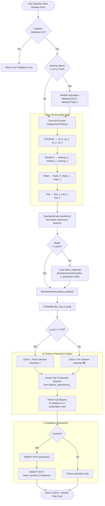

# ❤️ Heart Disease Prediction AI — Complete Model Specification

**Model**: Random Forest Classifier | **Dataset**: Cleveland Clinic Heart Disease | **Target**: Disease Present (1) / Absent (0)

---

## 📋 1. Model Overview

The Heart Disease AI evaluates 13 clinical indicators — ranging from resting ECG results to exercise stress tests — to determine the presence of coronary artery disease. Cardiovascular disease is the **leading cause of death in India**, responsible for 28.1% of all deaths (Lancet, 2022).

### Clinical Significance
- Detection at subclinical stage reduces 5-year mortality by up to 30%
- The Oldpeak (ST depression) and Thalassemia type are the most predictive features
- Random Forest is chosen for its ability to capture non-linear interactions between cardiac indicators

---

## 📊 2. Feature Data Dictionary

| Feature | Type | Clinical Description | Values | Input Widget |
|:---|:---:|:---|:---:|:---|
| `Age` | Integer | Patient age | 29–77 years | Slider |
| `Sex` | Binary | Biological sex | 0=Female, 1=Male | Select |
| `ChestPain (CP)` | Categorical | Chest pain classification | 0: Typical Angina, 1: Atypical Angina, 2: Non-anginal Pain, 3: Asymptomatic | Radio |
| `TrestBps` | Float | Resting systolic blood pressure | 94–200 mm Hg | Number input |
| `Chol` | Float | Serum cholesterol level | 126–564 mg/dL | Number input |
| `FBS` | Binary | Fasting blood sugar > 120 mg/dL | 0=No, 1=Yes | Toggle |
| `RestECG` | Categorical | Resting ECG result | 0: Normal, 1: ST-T Anomaly, 2: LV Hypertrophy | Select |
| `Thalach` | Float | Maximum heart rate in stress test | 71–202 bpm | Slider |
| `ExAng` | Binary | Exercise-induced angina | 0=No, 1=Yes | Toggle |
| `Oldpeak` | Float | ST depression induced by exercise | 0.0–6.2 | Float input |
| `Slope` | Categorical | ST segment slope | 0: Upsloping, 1: Flat, 2: Downsloping | Select |
| `CA` | Integer | Major vessels via fluoroscopy | 0–4 | Slider |
| `Thal` | Categorical | Thalassemia type | 1: Normal, 2: Fixed Defect, 3: Reversible Defect | Select |

---

## 🔬 3. Dataset Profile

| Property | Value |
|:---|:---|
| Source Dataset | Cleveland Clinic Heart Disease (UCI ML Repository) |
| Total Samples | 303 rows |
| Positive Class (Disease) | 165 (54.5%) |
| Negative Class (No Disease) | 138 (45.5%) |
| Missing Values | 6 values (CA and Thal columns) → Median imputed |
| Train Split | 80% (242 samples) |
| Test Split | 20% (61 samples) |

---

## 🔄 4. Complete Data Pipeline & Inference Flowchart



---

## 📈 5. Model Selection & Benchmarking

| Algorithm | Accuracy | Precision | Recall | F1-Score | ROC-AUC | Status |
|:---|:---:|:---:|:---:|:---:|:---:|:---:|
| Logistic Regression | 84.1% | 83.2% | 85.0% | 0.841 | 0.898 | Backup |
| Decision Tree | 73.8% | 72.1% | 75.4% | 0.737 | 0.742 | Rejected |
| **Random Forest** ⭐ | **86.9%** | **85.7%** | **88.2%** | **0.869** | **0.923** | **Production** |
| XGBoost | 85.2% | 84.5% | 86.1% | 0.853 | 0.910 | Candidate |
| LightGBM | 84.8% | 84.0% | 85.7% | 0.848 | 0.905 | Candidate |

**Top 5 Feature Importances** (from MDI):
1. `ca` (Major vessels) — 0.183
2. `thal_2` (Thalassemia Fixed Defect) — 0.142
3. `oldpeak` (ST Depression) — 0.128
4. `cp_3` (Asymptomatic Chest Pain) — 0.110
5. `thalach` (Max Heart Rate) — 0.097

---

## 🗄️ 6. Supabase Database Schema

```sql
CREATE TABLE heart_records (
    id UUID PRIMARY KEY DEFAULT gen_random_uuid(),
    prediction_id UUID NOT NULL REFERENCES predictions(id) ON DELETE CASCADE,
    age INT NOT NULL CHECK (age BETWEEN 1 AND 120),
    sex INT NOT NULL CHECK (sex IN (0, 1)),
    chest_pain_type INT NOT NULL CHECK (chest_pain_type BETWEEN 0 AND 3),
    resting_bp NUMERIC(5, 2) NOT NULL CHECK (resting_bp > 0),
    cholesterol NUMERIC(5, 2) NOT NULL CHECK (cholesterol > 0),
    fasting_blood_sugar INT NOT NULL CHECK (fasting_blood_sugar IN (0, 1)),
    rest_ecg INT NOT NULL CHECK (rest_ecg BETWEEN 0 AND 2),
    max_heart_rate NUMERIC(5, 2) NOT NULL CHECK (max_heart_rate > 0),
    exercise_angina INT NOT NULL CHECK (exercise_angina IN (0, 1)),
    oldpeak NUMERIC(4, 2) NOT NULL CHECK (oldpeak >= 0),
    st_slope INT NOT NULL CHECK (st_slope BETWEEN 0 AND 2),
    vessels_colored INT NOT NULL CHECK (vessels_colored BETWEEN 0 AND 4),
    thalassemia INT NOT NULL CHECK (thalassemia BETWEEN 1 AND 3),
    created_at TIMESTAMPTZ DEFAULT NOW() NOT NULL
);

CREATE INDEX idx_heart_records_prediction_id ON heart_records(prediction_id);

ALTER TABLE heart_records ENABLE ROW LEVEL SECURITY;

CREATE POLICY "heart_select_own" ON heart_records
    FOR SELECT USING (
        EXISTS (
            SELECT 1 FROM predictions
            WHERE predictions.id = heart_records.prediction_id
            AND predictions.user_id = auth.uid()
        )
    );

CREATE POLICY "heart_insert_own" ON heart_records
    FOR INSERT WITH CHECK (
        EXISTS (
            SELECT 1 FROM predictions
            WHERE predictions.id = heart_records.prediction_id
            AND predictions.user_id = auth.uid()
        )
    );
```
