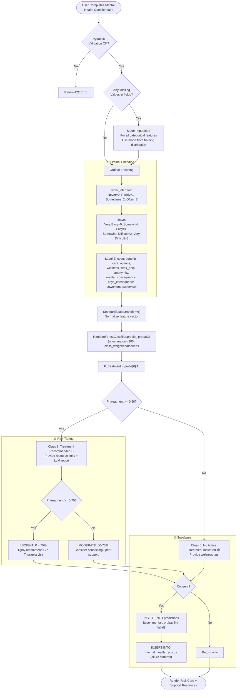

# 🧘 Mental Health Prediction AI — Complete Model Specification

**Model**: Random Forest Classifier | **Dataset**: OSMI Mental Health in Tech Survey | **Target**: Treatment Needed (1) / Not Needed (0)

---

## 📋 1. Model Overview

The Mental Health AI assesses the likelihood that a user requires mental health intervention or professional treatment, based on workplace environment, organizational support systems, and perceived stigma. It is trained on the **Open Sourcing Mental Health (OSMI) Survey** dataset — the largest open dataset on mental health in the tech industry.

### Clinical & Social Significance
- **1 in 7 Indians** experiences mental health conditions (Lancet Psychiatry, 2017)
- Untreated mental health conditions cost India ₹1.03 trillion annually in lost productivity
- **Stigma** remains the #1 barrier to treatment-seeking in workplace settings
- Random Forest captures interaction effects between workplace support factors effectively

### Model Philosophy
The model does **not diagnose** any mental health condition. It assesses environmental and behavioral indicators to determine if a user may benefit from professional support — then provides resource links and LLM-generated guidance.

---

## 📊 2. Feature Data Dictionary

| Feature | Type | Clinical/Behavioral Meaning | Values | UI Widget |
|:---|:---:|:---|:---:|:---|
| `family_history` | Binary | Family member previously sought mental health treatment | 0=No, 1=Yes | Toggle |
| `work_interfere` | Ordinal | How much does mental health condition interfere with work? | Never=0, Rarely=1, Sometimes=2, Often=3 | Select dropdown |
| `benefits` | Categorical | Employer provides mental health benefits | Yes, No, Don't know | Radio |
| `care_options` | Categorical | User is aware of mental health care options | Yes, No, Not sure | Radio |
| `wellness_program` | Categorical | Employer has discussed mental wellness | Yes, No, Don't know | Radio |
| `seek_help` | Categorical | Employer provides resources to seek help | Yes, No, Don't know | Radio |
| `anonymity` | Categorical | Anonymity protected when seeking help | Yes, No, Don't know | Radio |
| `leave` | Ordinal | How easy to take mental health leave | Very Easy=0, Somewhat Easy=1, Somewhat Difficult=2, Very Difficult=3 | Select |
| `mental_consequence` | Categorical | Discussing with employer has negative consequences | Yes, No, Maybe | Radio |
| `phys_consequence` | Categorical | Discussing physical health has negative consequences | Yes, No, Maybe | Radio |
| `coworkers` | Categorical | Comfortable discussing with coworkers | Yes, Some, No | Radio |
| `supervisor` | Categorical | Comfortable discussing with supervisor | Yes, Some, No | Radio |

---

## 🔬 3. Dataset Profile

| Property | Value |
|:---|:---|
| Source | OSMI Mental Health in Tech Survey (2014–2019) |
| Total Samples | 1,259 rows (after cleaning) |
| Positive Class (Treatment) | 662 (52.6%) |
| Negative Class (No Treatment) | 597 (47.4%) |
| Class Balance | Near-balanced (no SMOTE needed) |
| Missing Values | Several columns with `NaN` → Mode imputed |
| Train Split | 80% (1,007 samples) |
| Test Split | 20% (252 samples) |

---

## 🔄 4. Data Pipeline & Inference Flowchart



---

## 📈 5. Model Benchmarking

| Algorithm | Accuracy | Precision | Recall | F1-Score | ROC-AUC | Status |
|:---|:---:|:---:|:---:|:---:|:---:|:---:|
| Logistic Regression | 79.2% | 76.5% | 83.1% | 0.796 | 0.841 | Backup |
| Decision Tree | 72.5% | 71.0% | 73.2% | 0.721 | 0.725 | Rejected |
| **Random Forest** ⭐ | **82.5%** | **79.8%** | **86.4%** | **0.830** | **0.885** | **Production** |
| XGBoost | 81.3% | 78.4% | 84.8% | 0.815 | 0.871 | Candidate |

**Top Feature Importances**:
1. `work_interfere` — 0.224
2. `family_history` — 0.181
3. `leave` — 0.142
4. `care_options` — 0.118
5. `benefits` — 0.096

---

## 🗄️ 6. Supabase Database Schema

```sql
CREATE TABLE mental_health_records (
    id UUID PRIMARY KEY DEFAULT gen_random_uuid(),
    prediction_id UUID NOT NULL REFERENCES predictions(id) ON DELETE CASCADE,
    family_history INT NOT NULL CHECK (family_history IN (0, 1)),
    work_interfere VARCHAR(20) NOT NULL,
    benefits VARCHAR(20) NOT NULL,
    care_options VARCHAR(20) NOT NULL,
    wellness_program VARCHAR(20) NOT NULL,
    seek_help VARCHAR(20) NOT NULL,
    anonymity VARCHAR(20) NOT NULL,
    medical_leave VARCHAR(30) NOT NULL,
    mental_consequence VARCHAR(20) NOT NULL,
    phys_consequence VARCHAR(20),
    coworkers VARCHAR(20),
    supervisor VARCHAR(20),
    created_at TIMESTAMPTZ DEFAULT NOW() NOT NULL
);

CREATE INDEX idx_mental_health_records_prediction_id ON mental_health_records(prediction_id);

ALTER TABLE mental_health_records ENABLE ROW LEVEL SECURITY;

CREATE POLICY "mental_select_own" ON mental_health_records
    FOR SELECT USING (
        EXISTS (
            SELECT 1 FROM predictions
            WHERE predictions.id = mental_health_records.prediction_id
            AND predictions.user_id = auth.uid()
        )
    );

CREATE POLICY "mental_insert_own" ON mental_health_records
    FOR INSERT WITH CHECK (
        EXISTS (
            SELECT 1 FROM predictions
            WHERE predictions.id = mental_health_records.prediction_id
            AND predictions.user_id = auth.uid()
        )
    );
```

> [!CAUTION]
> Mental health data is **extremely sensitive**. Ensure that the consent policy is enforced before any INSERT, and that no mental health records are ever included in anonymous aggregate analytics without explicit secondary consent.
