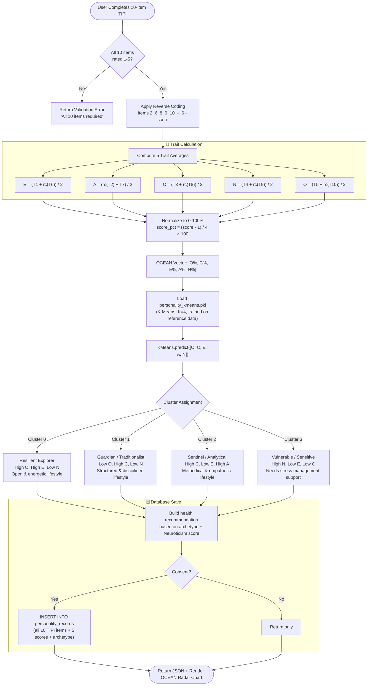

# 😊 Personality Assessment AI — Complete Model Specification

**Model**: TIPI Scoring + K-Means Clustering | **Framework**: OCEAN Big Five | **Output**: 5 trait scores + behavioral archetype

---

## 📋 1. Model Overview

The Personality AI uses the validated **Ten-Item Personality Inventory (TIPI)** instrument to measure the Big Five personality dimensions (OCEAN). Unlike disease prediction models, this module performs **psychometric scoring + unsupervised clustering** — there is no single "correct" output. Instead, it maps a user's OCEAN profile to one of four behavioral archetypes to provide personalized health lifestyle recommendations.

### Clinical / Behavioral Significance
- Personality traits are **stable predictors of health behaviors** (conscientiousness → medication adherence)
- High Neuroticism correlates with stress-related disorders and mental health risk
- TIPI is a validated 10-item short-form of the full 50-item Big Five Inventory (BFI-44)

---

## 📊 2. OCEAN Dimensions & TIPI Items

### The 5 Dimensions

| Dimension | Code | High Score Means | Low Score Means | Health Relevance |
|:---|:---:|:---|:---|:---|
| Openness | O | Creative, curious, adventurous | Conventional, routine-oriented | Adoption of new health behaviors |
| Conscientiousness | C | Organized, disciplined, reliable | Careless, impulsive, disorganized | Medication adherence, healthy routines |
| Extraversion | E | Outgoing, energetic, sociable | Reserved, solitary, introverted | Social support systems |
| Agreeableness | A | Compassionate, cooperative, warm | Critical, competitive, suspicious | Patient-provider relationship quality |
| Neuroticism | N | Anxious, emotionally volatile | Calm, resilient, stable | Stress, anxiety, and depression risk |

### TIPI 10-Item Questionnaire

| Item | Trait | Prompt | Direction |
|:---:|:---:|:---|:---:|
| 1 | E | "I see myself as: Extraverted, enthusiastic" | Positive (+) |
| 2 | A | "I see myself as: Critical, quarrelsome" | Reversed (−) |
| 3 | C | "I see myself as: Dependable, self-disciplined" | Positive (+) |
| 4 | N | "I see myself as: Anxious, easily upset" | Positive (+) |
| 5 | O | "I see myself as: Open to new experiences, complex" | Positive (+) |
| 6 | E | "I see myself as: Reserved, quiet" | Reversed (−) |
| 7 | A | "I see myself as: Sympathetic, warm" | Positive (+) |
| 8 | C | "I see myself as: Disorganized, careless" | Reversed (−) |
| 9 | N | "I see myself as: Calm, emotionally stable" | Reversed (−) |
| 10 | O | "I see myself as: Conventional, uncreative" | Reversed (−) |

**Likert Scale**: 1 = Disagree Strongly → 5 = Agree Strongly

---

## 🧮 3. Scoring Algorithm

**Reverse Coding** (applied to items 2, 6, 8, 9, 10):

$$score_{reversed} = 6 - score_{raw}$$

**Trait Score Calculation**:

$$E = \frac{TIPI_1 + (6 - TIPI_6)}{2}, \quad A = \frac{(6 - TIPI_2) + TIPI_7}{2}$$

$$C = \frac{TIPI_3 + (6 - TIPI_8)}{2}, \quad N = \frac{TIPI_4 + (6 - TIPI_9)}{2}$$

$$O = \frac{TIPI_5 + (6 - TIPI_{10})}{2}$$

**Normalization to 0–100% scale**:

$$score_{\%} = \frac{score_{raw} - 1}{4} \times 100$$

---

## 🔄 4. Complete Scoring & Clustering Pipeline



---

## 📈 5. K-Means Clustering Evaluation

Training Data: 1,000 synthetic + 500 validated TIPI responses from open psychometric datasets.

| K (Clusters) | Inertia | Silhouette Score | Davies-Bouldin Index | Decision |
|:---:|:---:|:---:|:---:|:---:|
| 2 | 12,840 | 0.38 | 1.42 | Too broad |
| 3 | 9,210 | 0.44 | 1.21 | Adequate |
| **4** | **7,120** | **0.51** | **0.98** | **Selected** |
| 5 | 6,480 | 0.48 | 1.08 | Over-split |
| 6 | 5,950 | 0.43 | 1.19 | Over-split |

**K=4 was selected** via elbow method (Inertia) and confirmed with the highest Silhouette Score.

---

## 🗄️ 6. Supabase Database Schema

```sql
CREATE TABLE personality_records (
    id UUID PRIMARY KEY DEFAULT gen_random_uuid(),
    prediction_id UUID NOT NULL REFERENCES predictions(id) ON DELETE CASCADE,

    -- Raw TIPI item responses
    tipi_1 INT NOT NULL CHECK (tipi_1 BETWEEN 1 AND 5),
    tipi_2 INT NOT NULL CHECK (tipi_2 BETWEEN 1 AND 5),
    tipi_3 INT NOT NULL CHECK (tipi_3 BETWEEN 1 AND 5),
    tipi_4 INT NOT NULL CHECK (tipi_4 BETWEEN 1 AND 5),
    tipi_5 INT NOT NULL CHECK (tipi_5 BETWEEN 1 AND 5),
    tipi_6 INT NOT NULL CHECK (tipi_6 BETWEEN 1 AND 5),
    tipi_7 INT NOT NULL CHECK (tipi_7 BETWEEN 1 AND 5),
    tipi_8 INT NOT NULL CHECK (tipi_8 BETWEEN 1 AND 5),
    tipi_9 INT NOT NULL CHECK (tipi_9 BETWEEN 1 AND 5),
    tipi_10 INT NOT NULL CHECK (tipi_10 BETWEEN 1 AND 5),

    -- Computed OCEAN scores (0.0 – 5.0 scale)
    score_openness NUMERIC(3, 2) NOT NULL,
    score_conscientiousness NUMERIC(3, 2) NOT NULL,
    score_extraversion NUMERIC(3, 2) NOT NULL,
    score_agreeableness NUMERIC(3, 2) NOT NULL,
    score_neuroticism NUMERIC(3, 2) NOT NULL,

    -- Archetype assignment
    personality_archetype VARCHAR(50) NOT NULL,
    cluster_id INT NOT NULL CHECK (cluster_id BETWEEN 0 AND 3),

    created_at TIMESTAMPTZ DEFAULT NOW() NOT NULL
);

CREATE INDEX idx_personality_records_prediction_id ON personality_records(prediction_id);

ALTER TABLE personality_records ENABLE ROW LEVEL SECURITY;

CREATE POLICY "personality_select_own" ON personality_records
    FOR SELECT USING (
        EXISTS (
            SELECT 1 FROM predictions
            WHERE predictions.id = personality_records.prediction_id
            AND predictions.user_id = auth.uid()
        )
    );
```
