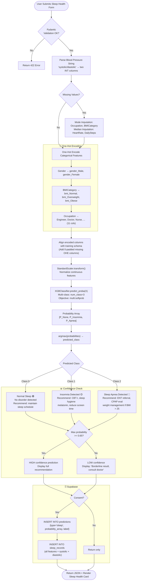

# 😴 Sleep Health Prediction AI — Complete Model Specification

**Model**: XGBoost Multi-class Classifier | **Dataset**: Sleep Health & Lifestyle Dataset | **Output**: None / Insomnia / Sleep Apnea

---

## 📋 1. Model Overview

The Sleep Health AI is the **only multi-class classifier** in the HealthAI India platform. It categorizes a user's sleep profile into three distinct categories: Normal Sleep, Insomnia, or Sleep Apnea — based on lifestyle metrics, physiological indicators, and sleep habit self-reports.

### Clinical Significance
- **150 million Indians** suffer from sleep disorders (IISc Sleep Study, 2023)
- Insomnia is directly linked to a 45% increased risk of cardiovascular events
- Sleep Apnea is associated with a 2-4x increased stroke risk
- Untreated sleep disorders cost India an estimated $19.5 billion annually in lost productivity

### Why Multi-class Output?
Insomnia and Sleep Apnea have different clinical pathways, interventions, and urgencies:
- **Insomnia** → Cognitive Behavioral Therapy for Insomnia (CBT-I), sleep hygiene, melatonin
- **Sleep Apnea** → CPAP machine, ENT referral, weight management

---

## 📊 2. Feature Data Dictionary

| Feature | Type | Clinical Description | Range / Values | UI Widget |
|:---|:---:|:---|:---:|:---|
| `Gender` | Categorical | Biological sex | Male, Female | Radio |
| `Age` | Integer | Patient age | 18–80 years | Slider |
| `Occupation` | Categorical | Job category (stress proxy) | Engineer, Doctor, Nurse, Sales, Teacher, Software Engineer, Accountant, Lawyer, Manager, Scientist, Others | Select |
| `SleepDuration` | Float | Hours of sleep per night | 4.0–9.5 hours | Slider |
| `QualityOfSleep` | Integer | Subjective sleep quality | 1 (Poor) → 10 (Excellent) | Slider |
| `PhysicalActivityLevel` | Integer | Minutes of daily physical activity | 0–90 minutes | Number input |
| `StressLevel` | Integer | Subjective stress level | 1 (Low) → 10 (High) | Slider |
| `BMICategory` | Categorical | BMI classification | Normal, Overweight, Obese | Select |
| `BloodPressure` | String | Systolic/Diastolic (parsed) | e.g. "120/80" | Two number inputs |
| `HeartRate` | Integer | Resting heart rate | 50–100 bpm | Number input |
| `DailySteps` | Integer | Average daily step count | 3,000–10,000 | Number input |

**Blood Pressure Parsing**:
```python
# Parse "120/80" → systolic=120, diastolic=80
systolic, diastolic = map(int, blood_pressure_string.split("/"))
```

---

## 🔬 3. Dataset Profile

| Property | Value |
|:---|:---|
| Source | Sleep Health and Lifestyle Dataset (Kaggle) |
| Total Samples | 374 rows |
| Class 0 — None (Normal) | 219 (58.6%) |
| Class 1 — Insomnia | 77 (20.6%) |
| Class 2 — Sleep Apnea | 78 (20.8%) |
| Missing Values | None in source data |
| Train Split | 80% (299 samples) |
| Test Split | 20% (75 samples) |
| Encoding | `class_weight='balanced'` for minority class handling |

---

## 🔄 4. Complete Data Pipeline & Inference Flowchart



---

## 📈 5. Model Benchmarking (Multi-Class — Macro Averaged)

| Algorithm | Accuracy | Precision (Macro) | Recall (Macro) | F1 (Macro) | Status |
|:---|:---:|:---:|:---:|:---:|:---:|
| Logistic Regression | 82.3% | 79.4% | 78.1% | 0.787 | Backup |
| Decision Tree | 85.1% | 82.2% | 83.0% | 0.826 | Candidate |
| Random Forest | 88.5% | 86.3% | 85.9% | 0.861 | Candidate |
| **XGBoost** ⭐ | **90.2%** | **88.9%** | **88.1%** | **0.885** | **Production** |

**Per-Class Breakdown (XGBoost)**:

| Class | Precision | Recall | F1-Score | Support |
|:---:|:---:|:---:|:---:|:---:|
| None (0) | 93.1% | 94.5% | 0.938 | 44 |
| Insomnia (1) | 87.2% | 84.6% | 0.858 | 16 |
| Sleep Apnea (2) | 86.4% | 85.3% | 0.858 | 15 |
| **Weighted Avg** | **90.7%** | **90.2%** | **0.903** | 75 |

**Key XGBoost Hyperparameters**:
```python
params = {
    'n_estimators': 300,
    'max_depth': 5,
    'learning_rate': 0.08,
    'objective': 'multi:softprob',
    'num_class': 3,
    'subsample': 0.85,
    'colsample_bytree': 0.85,
    'use_label_encoder': False,
    'eval_metric': 'mlogloss'
}
```

---

## 🗄️ 6. Supabase Database Schema

```sql
CREATE TABLE sleep_records (
    id UUID PRIMARY KEY DEFAULT gen_random_uuid(),
    prediction_id UUID NOT NULL REFERENCES predictions(id) ON DELETE CASCADE,
    gender VARCHAR(10) NOT NULL CHECK (gender IN ('Male', 'Female')),
    age INT NOT NULL CHECK (age BETWEEN 1 AND 120),
    occupation VARCHAR(50) NOT NULL,
    sleep_duration NUMERIC(3, 1) NOT NULL CHECK (sleep_duration > 0),
    quality_of_sleep INT NOT NULL CHECK (quality_of_sleep BETWEEN 1 AND 10),
    physical_activity_level INT NOT NULL CHECK (physical_activity_level >= 0),
    stress_level INT NOT NULL CHECK (stress_level BETWEEN 1 AND 10),
    bmi_category VARCHAR(20) NOT NULL CHECK (bmi_category IN ('Normal', 'Overweight', 'Obese')),
    systolic_bp INT NOT NULL CHECK (systolic_bp BETWEEN 70 AND 250),
    diastolic_bp INT NOT NULL CHECK (diastolic_bp BETWEEN 40 AND 150),
    heart_rate INT NOT NULL CHECK (heart_rate BETWEEN 30 AND 220),
    daily_steps INT NOT NULL CHECK (daily_steps >= 0),
    predicted_disorder VARCHAR(20) NOT NULL CHECK (predicted_disorder IN ('None', 'Insomnia', 'Sleep Apnea')),
    prediction_confidence NUMERIC(4, 3),
    created_at TIMESTAMPTZ DEFAULT NOW() NOT NULL
);

CREATE INDEX idx_sleep_records_prediction_id ON sleep_records(prediction_id);

ALTER TABLE sleep_records ENABLE ROW LEVEL SECURITY;

CREATE POLICY "sleep_select_own" ON sleep_records
    FOR SELECT USING (
        EXISTS (
            SELECT 1 FROM predictions
            WHERE predictions.id = sleep_records.prediction_id
            AND predictions.user_id = auth.uid()
        )
    );

CREATE POLICY "sleep_insert_own" ON sleep_records
    FOR INSERT WITH CHECK (
        EXISTS (
            SELECT 1 FROM predictions
            WHERE predictions.id = sleep_records.prediction_id
            AND predictions.user_id = auth.uid()
        )
    );
```
