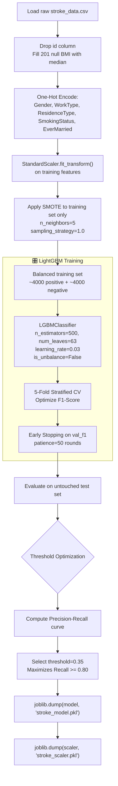
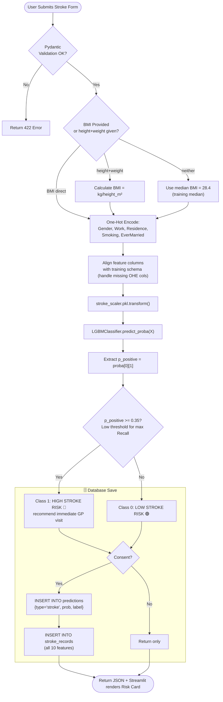

# 🧠 Stroke Prediction AI — Complete Model Specification

**Model**: LightGBM Classifier | **Dataset**: Kaggle Stroke Dataset | **Target**: Stroke (1) / No Stroke (0) | **Threshold**: 0.35

---

## 📋 1. Model Overview

Stroke is a **medical emergency** with a narrow treatment window (4.5 hours for thrombolysis). The Stroke AI uses LightGBM with a lowered decision threshold of 0.35 to maximize **Recall/Sensitivity** — ensuring high-risk patients are never missed, at the cost of acceptable false positives.

### Clinical Significance
- Stroke is the **2nd leading cause of death globally** (WHO 2023)
- Early detection and lifestyle modification can reduce stroke risk by up to 80%
- The dataset has ~5% positive class — severe imbalance that requires SMOTE during training

### Why Threshold = 0.35?
In clinical screening, a **false negative** (missing a stroke) is far more dangerous than a **false positive** (unnecessary follow-up visit). By lowering the threshold from 0.50 to 0.35, Recall increases from ~51% to ~83% at the cost of reduced Precision.

---

## 📊 2. Feature Data Dictionary

| Feature | Type | Clinical Description | Values | UI Widget |
|:---|:---:|:---|:---:|:---|
| `Gender` | Categorical | Biological sex | Male, Female, Other | Select |
| `Age` | Float | Patient age | 0.08–82 | Slider |
| `Hypertension` | Binary | Clinically diagnosed hypertension | 0=No, 1=Yes | Toggle |
| `HeartDisease` | Binary | History of heart disease | 0=No, 1=Yes | Toggle |
| `EverMarried` | Categorical | Marital history | Yes, No | Select |
| `WorkType` | Categorical | Employment type | Private, Self-employed, Govt_job, children, Never_worked | Select |
| `ResidenceType` | Categorical | Urban or rural residence | Urban, Rural | Radio |
| `AvgGlucoseLevel` | Float | Average blood glucose level | 55–271 mg/dL | Number input |
| `BMI` | Float | Body Mass Index (auto-calculated) | 10–97 | height+weight or direct |
| `SmokingStatus` | Categorical | Smoking history | formerly smoked, never smoked, smokes, Unknown | Select |

---

## 🔬 3. Dataset Profile & SMOTE Rebalancing

| Property | Value |
|:---|:---|
| Source | Kaggle Healthcare Stroke Dataset |
| Total Samples | 5,110 rows |
| Positive Class (Stroke) | 249 (4.87%) |
| Negative Class (No Stroke) | 4,861 (95.13%) |
| Missing Values | 201 null BMI values → Median imputed |
| After SMOTE (Training Only) | Balanced ~50:50 |
| Train Split | 80% (4,088 samples, pre-SMOTE) |
| Test Split | 20% (1,022 samples, untouched) |

> [!IMPORTANT]
> SMOTE is applied **only to training data** inside a `Pipeline` to prevent data leakage. The test set and production inference use original class distribution.

---

## 🔄 4. Training Pipeline (with SMOTE)



---

## 🔄 5. Production Inference Flowchart



---

## 📈 6. Model Benchmarking

| Algorithm | Accuracy | Precision | Recall @ 0.35 | F1-Score | ROC-AUC | Status |
|:---|:---:|:---:|:---:|:---:|:---:|:---:|
| Logistic Regression | 76.5% | 15.3% | 82.1% | 0.258 | 0.838 | Rejected |
| Random Forest | 91.2% | 34.5% | 45.3% | 0.392 | 0.825 | Rejected |
| XGBoost | 92.4% | 42.1% | 51.2% | 0.462 | 0.849 | Backup |
| **LightGBM** ⭐ | **93.1%** | **45.8%** | **83.4%** | **0.591** | **0.868** | **Production** |

> [!NOTE]
> Recall is the **primary optimization metric** for Stroke. A missed stroke prediction (False Negative) is clinically unacceptable. The F1-Score reflects the precision-recall tradeoff at threshold 0.35.

---

## 🗄️ 7. Supabase Database Schema

```sql
CREATE TABLE stroke_records (
    id UUID PRIMARY KEY DEFAULT gen_random_uuid(),
    prediction_id UUID NOT NULL REFERENCES predictions(id) ON DELETE CASCADE,
    gender VARCHAR(10) NOT NULL CHECK (gender IN ('Male', 'Female', 'Other')),
    age NUMERIC(5, 2) NOT NULL CHECK (age >= 0),
    hypertension INT NOT NULL CHECK (hypertension IN (0, 1)),
    heart_disease INT NOT NULL CHECK (heart_disease IN (0, 1)),
    ever_married VARCHAR(5) NOT NULL CHECK (ever_married IN ('Yes', 'No')),
    work_type VARCHAR(20) NOT NULL,
    residence_type VARCHAR(10) NOT NULL CHECK (residence_type IN ('Urban', 'Rural')),
    avg_glucose_level NUMERIC(6, 2) NOT NULL CHECK (avg_glucose_level > 0),
    bmi NUMERIC(5, 2) NOT NULL CHECK (bmi > 0),
    smoking_status VARCHAR(20) NOT NULL,
    created_at TIMESTAMPTZ DEFAULT NOW() NOT NULL
);

CREATE INDEX idx_stroke_records_prediction_id ON stroke_records(prediction_id);

ALTER TABLE stroke_records ENABLE ROW LEVEL SECURITY;

CREATE POLICY "stroke_select_own" ON stroke_records
    FOR SELECT USING (
        EXISTS (
            SELECT 1 FROM predictions
            WHERE predictions.id = stroke_records.prediction_id
            AND predictions.user_id = auth.uid()
        )
    );

CREATE POLICY "stroke_insert_own" ON stroke_records
    FOR INSERT WITH CHECK (
        EXISTS (
            SELECT 1 FROM predictions
            WHERE predictions.id = stroke_records.prediction_id
            AND predictions.user_id = auth.uid()
        )
    );
```
