# 📋 Product Requirements Document (PRD) — HealthAI India

HealthAI India is an indigenous, AI-powered preventive healthcare platform built with the vision of becoming a **Made in India Healthcare AI Ecosystem**. The initial version provides zero-barrier, anonymous health risk assessments across 6 health domains — no login, no signup, no friction.

---

## 📌 Table of Contents

1. [Product Vision & Goals](#-1-product-vision--goals)
2. [Product Architecture & Feature Mindmap](#-2-product-architecture--feature-mindmap)
3. [User Flow](#-3-user-flow)
4. [User Personas & Journey Maps](#-4-user-personas--journey-maps)
5. [Prediction Modules — Functional Requirements](#-5-prediction-modules--functional-requirements)
6. [Questionnaire Design Principles](#-6-questionnaire-design-principles)
7. [Supabase Integration — Anonymous Prediction Storage](#-7-supabase-integration--anonymous-prediction-storage)
8. [Power BI Analytics](#-8-power-bi-analytics)
9. [Incremental Release Roadmap](#-9-incremental-release-roadmap)
10. [Success Metrics (KPIs)](#-10-success-metrics-kpis)
11. [What's In vs. What's Out](#-11-whats-in-vs-whats-out)

---

## 🎯 1. Product Vision & Goals

### Current Phase (MVP)

1. **Zero-Barrier Access**: Any visitor can use any prediction module instantly — no account creation, no authentication.
2. **Multi-Domain Screening**: Risk assessments for Diabetes, Heart Disease, Stroke, Personality, Mental Health, and Sleep Health.
3. **Human-Friendly Questionnaires**: Plain-language questions — never raw dataset column names. BMI calculated from height/weight automatically.
4. **Anonymous Data Collection**: Every prediction stored with timestamp, responses, calculated features, prediction, and confidence score — no personal identity.
5. **Incremental Delivery**: Each phase delivers a fully working, deployable application.

### Future Phase

6. **Explainable AI**: Open-source models (Gemma, Llama, Mistral, Phi) explain predictions and generate health reports.
7. **AI Health Assistant**: Conversational AI layer that answers user questions based on prediction context.

### Long-Term Vision

8. **Made in India AI Healthcare Stack**: Indigenous medical LLM, Indian Medical Knowledge Base, Indian language support, and continuous learning from user-consented data.

---

## 🧠 2. Product Architecture & Feature Mindmap

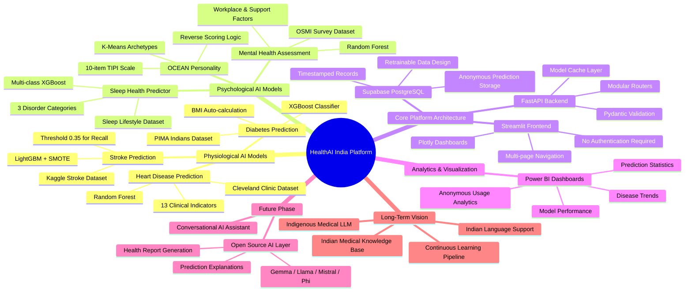

---

## 🔄 3. User Flow

### Complete User Journey (No Authentication)

```text
User visits website
        │
        ▼
Select Disease / Health Module
        │
        ▼
Fill Human-Friendly Questionnaire
        │
        ▼
ML Model Prediction (Backend)
        │
        ▼
Display Prediction Result
  (Risk Level + Confidence Score)
        │
        ▼
Store Anonymous Response
  (with timestamp) → Supabase
        │
        ▼
Optionally: Provide Feedback
        │
        ▼
Done — No account needed
```

**Key Principle**: The entire flow is completed in a single session. No login. No account creation. No personal data collection. The user can visit, predict, and leave.

---

## 👥 4. User Personas & Journey Maps

### Persona 1: Raj (42, Software Engineer)
- **Need**: Family history of diabetes; wants quick, frictionless self-screening.
- **Behavior**: High digital literacy, values privacy, prefers no signup hassle.
- **Journey**: Google search → Visit website → Select Diabetes → Fill questionnaire → Get risk prediction → Done.

### Persona 2: Dr. Priya (38, General Physician)
- **Need**: Wants a second-opinion screening tool to recommend to patients with limited lab access.
- **Behavior**: Trusts data, wants to see model confidence and feature importance.
- **Journey**: Bookmark website → Recommend to patient → Patient uses it → Discuss results.

### Persona 3: Anjali (26, Graduate Student)
- **Need**: Experiencing sleep disruption and anxiety; wants holistic mental + sleep assessment.
- **Behavior**: Prefers simple, non-intimidating interface; wants immediate answers.
- **Journey**: Link shared by friend → Visit website → Select Sleep Health → Fill questions → Get prediction → Also try Mental Health.

---

### User Journey: Raj — Diabetes Self-Screening

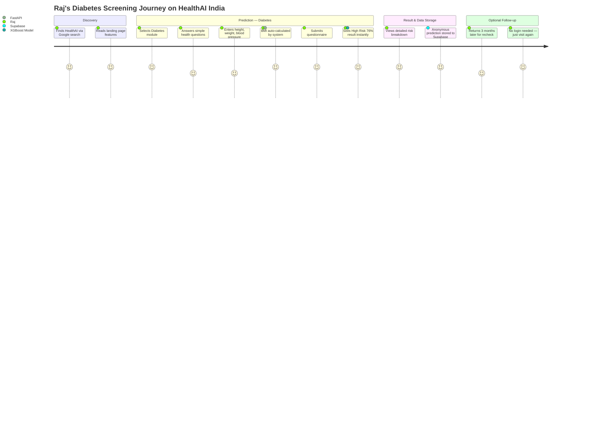

---

### User Journey: Anjali — Mental Health + Sleep Assessment

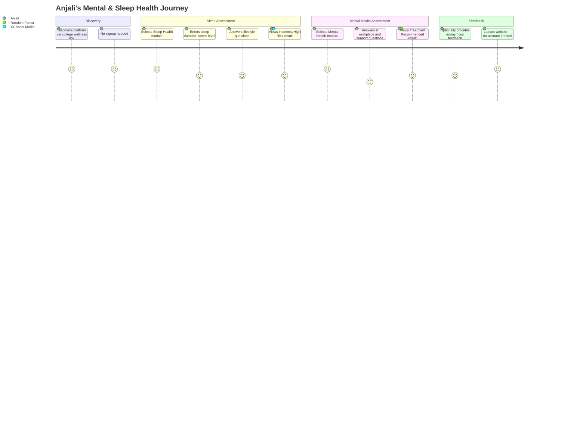

---

## 🩺 5. Prediction Modules — Functional Requirements

### Module 1: Diabetes Prediction

| Requirement | Detail |
|:---|:---|
| **Dataset** | PIMA Indians Diabetes Dataset |
| **Features** | Glucose, Blood Pressure, Skin Thickness, Insulin, BMI, Diabetes Pedigree Function, Age |
| **Target** | Binary: Diabetic (1) / Non-Diabetic (0) |
| **Models Evaluated** | Logistic Regression, Decision Tree, Random Forest, XGBoost, LightGBM |
| **Selected Model** | XGBoost Classifier (based on evaluation) |
| **Key UX Feature** | BMI auto-calculated from user-input height and weight |
| **Output** | Risk Level (Low/High) + Confidence Probability + Feature Importance |
| **Questionnaire Inputs** | "What is your blood glucose level?", "What is your blood pressure?", "How tall are you?", "How much do you weigh?", etc. |

---

### Module 2: Heart Disease Prediction

| Requirement | Detail |
|:---|:---|
| **Dataset** | Cleveland Clinic Heart Disease Dataset |
| **Features** | 13 clinical indicators (age, sex, chest pain type, resting BP, cholesterol, fasting blood sugar, resting ECG, max heart rate, exercise-induced angina, ST depression, slope, vessels, thal) |
| **Target** | Binary: Heart Disease (1) / No Heart Disease (0) |
| **Models Evaluated** | Logistic Regression, Decision Tree, Random Forest, XGBoost, LightGBM |
| **Selected Model** | Random Forest (based on evaluation) |
| **Output** | Risk Level + Confidence Probability + Contributing Factors |
| **Questionnaire Inputs** | "Do you experience chest pain?", "What type?", "What is your resting blood pressure?", "What is your cholesterol level?", etc. |

---

### Module 3: Stroke Prediction

| Requirement | Detail |
|:---|:---|
| **Dataset** | Kaggle Stroke Prediction Dataset |
| **Features** | Gender, Age, Hypertension, Heart Disease, Marital Status, Work Type, Residence Type, Average Glucose Level, BMI, Smoking Status |
| **Target** | Binary: Stroke (1) / No Stroke (0) |
| **Models Evaluated** | Logistic Regression, Decision Tree, Random Forest, XGBoost, LightGBM |
| **Selected Model** | LightGBM + SMOTE (optimized for recall at threshold 0.35) |
| **Output** | Risk Level + Confidence Probability + Key Risk Factors |
| **Questionnaire Inputs** | "Have you been diagnosed with hypertension?", "What is your average glucose level?", "Do you smoke?", etc. |

---

### Module 4: Personality Assessment

| Requirement | Detail |
|:---|:---|
| **Scale** | Ten-Item Personality Inventory (TIPI) |
| **Traits** | Openness (O), Conscientiousness (C), Extraversion (E), Agreeableness (A), Neuroticism (N) |
| **Models Evaluated** | K-Means Clustering for archetype classification |
| **Scoring** | Reverse scoring for items 2, 6, 8, 9, 10; OCEAN scores as averages |
| **Output** | Personality Archetype + OCEAN Score Breakdown (0–100%) |
| **Questionnaire Inputs** | 10 human-friendly questions mapping to TIPI items |

---

### Module 5: Mental Health Assessment

| Requirement | Detail |
|:---|:---|
| **Dataset** | OSMI Mental Health in Tech Survey Dataset |
| **Features** | Workplace factors, support availability, treatment history, family history |
| **Target** | Binary: Treatment Recommended (1) / Not Recommended (0) |
| **Models Evaluated** | Logistic Regression, Decision Tree, Random Forest, XGBoost |
| **Selected Model** | Random Forest (based on evaluation) |
| **Output** | Assessment Result + Confidence Score + Key Contributing Factors |
| **Questionnaire Inputs** | "Do you have a family history of mental illness?", "Do you feel supported at work?", "Have you sought treatment before?", etc. |

---

### Module 6: Sleep Health Prediction

| Requirement | Detail |
|:---|:---|
| **Dataset** | Sleep Lifestyle Dataset |
| **Features** | Sleep duration, sleep quality, stress level, physical activity, BMI category, occupation |
| **Target** | Multi-class: Sleep Disorder categories |
| **Models Evaluated** | Logistic Regression, Decision Tree, Random Forest, XGBoost |
| **Selected Model** | Multi-class XGBoost |
| **Output** | Sleep Health Category + Confidence Score + Risk Factors |
| **Questionnaire Inputs** | "How many hours do you sleep per night?", "How would you rate your sleep quality?", "How would you rate your daily stress level?", etc. |

---

## 📝 6. Questionnaire Design Principles

### Core Rule: No Raw Dataset Columns

Every questionnaire must be designed with these principles:

1. **Human-friendly language** — Questions read like a doctor's conversation, not a database query
2. **Automatic feature calculation** — BMI, risk scores, derived features computed by the backend
3. **Contextual help** — Each question includes brief guidance on what the answer means
4. **Logical ordering** — Questions flow naturally (demographics → lifestyle → clinical → family history)

### Design Examples

| ❌ Never Show This | ✅ Show This Instead |
|:---|:---|
| `GenHlth` (scale 1-5) | "How would you rate your overall health?" (Excellent / Very Good / Good / Fair / Poor) |
| `BMI` | "What is your height?" + "What is your weight?" → BMI calculated automatically |
| `Chol` | "What is your total cholesterol level?" (with unit clarification) |
| `FBS > 120` | "Is your fasting blood sugar level above 120 mg/dL?" (Yes / No) |
| `Smoker` | "What is your smoking status?" (Never / Former / Current) |
| `HighBP` | "Have you been diagnosed with high blood pressure?" (Yes / No) |
| `HeartDiseaseorAttack` | "Have you ever been told you have heart disease?" (Yes / No) |

---

## 🗄️ 7. Supabase Integration — Anonymous Prediction Storage

### Design Philosophy

Supabase remains the central database, but instead of storing registered users, it stores **anonymous prediction history**. This data serves two purposes:

1. **Analytics** — Power BI dashboards for disease trends and usage statistics
2. **Future Retraining** — Structured data designed for periodic model improvement

### Data Stored Per Prediction

| Field | Type | Description |
|:---|:---|:---|
| `id` | UUID | Unique prediction identifier (auto-generated) |
| `timestamp` | Timestamptz | Exact date and time of prediction |
| `disease_type` | Text | Module used (diabetes, heart, stroke, personality, mental_health, sleep_health) |
| `questionnaire_responses` | JSONB | All user-provided answers in original form |
| `calculated_features` | JSONB | Derived features (BMI, risk scores, encoded values) |
| `prediction` | Text | Model output (risk level or classification) |
| `confidence_score` | Float | Model confidence probability (0.0 – 1.0) |
| `model_version` | Text | Model identifier used for this prediction |
| `optional_feedback` | Text | User feedback if provided (nullable) |

### Data Design for Retraining

The schema is deliberately structured so that:

- Raw questionnaire responses are preserved (can be preprocessed again with new pipelines)
- Calculated features are stored (enables feature importance analysis)
- Model version is tracked (enables A/B comparison across model iterations)
- Timestamps allow temporal analysis (seasonal disease trends)
- All data is anonymous — no PII, no user identity

---

## 📊 8. Power BI Analytics

Power BI is used exclusively for analytics and visualization. It connects to Supabase and provides:

| Dashboard | Contents |
|:---|:---|
| **Disease Trends** | Prediction distribution across disease types over time |
| **Prediction Statistics** | Total predictions, risk distribution (high vs. low), average confidence scores |
| **Dataset Insights** | Feature distributions, demographic patterns in anonymous data |
| **Model Performance** | Aggregated prediction confidence, feedback accuracy rates |
| **Usage Analytics** | Peak usage times, most-used modules, geographic patterns (if available) |

**Note**: Power BI does NOT connect to any user identity system. All analytics are based on anonymous, aggregated prediction data.

---

## 📅 9. Incremental Release Roadmap

### Phase 0: Foundation

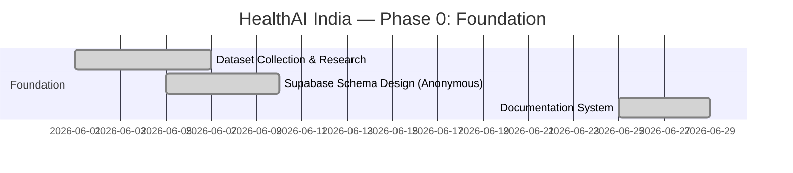

**Deliverable**: Supabase database configured, all datasets documented, data dictionaries created.

---

### Phase 1: Diabetes Prediction (MVP v1)

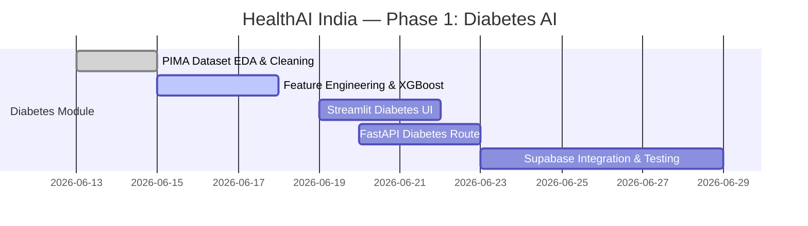

**Deliverable**: Working web application with Diabetes prediction. Anyone can visit and get a risk assessment.

**Repository**: Version 1 — Diabetes only.

---

### Phase 2: Heart Disease Prediction (MVP v2)

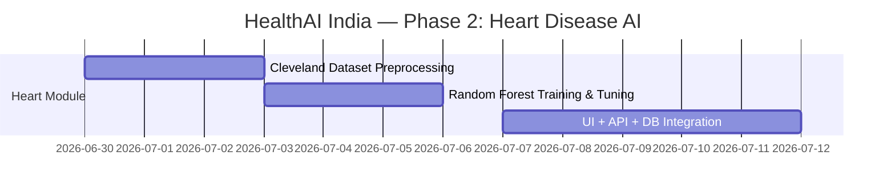

**Deliverable**: Diabetes + Heart Disease — fully working application.

**Repository**: Version 2 — Diabetes + Heart.

---

### Phase 3: Stroke Prediction (MVP v3)

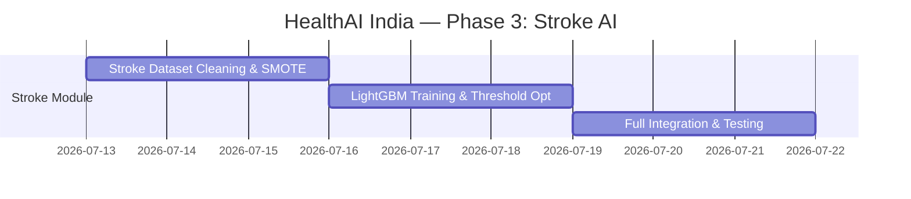

**Deliverable**: Diabetes + Heart + Stroke — fully working application.

**Repository**: Version 3 — Diabetes + Heart + Stroke.

---

### Phase 4: Personality Assessment (MVP v4)

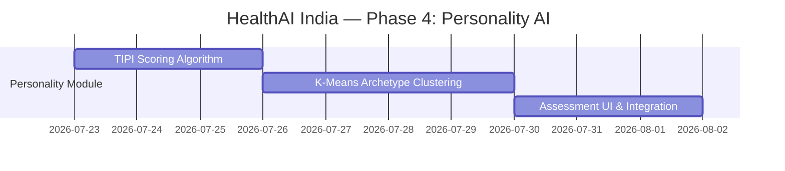

**Deliverable**: Diabetes + Heart + Stroke + Personality — fully working.

---

### Phase 5: Mental Health Assessment (MVP v5)

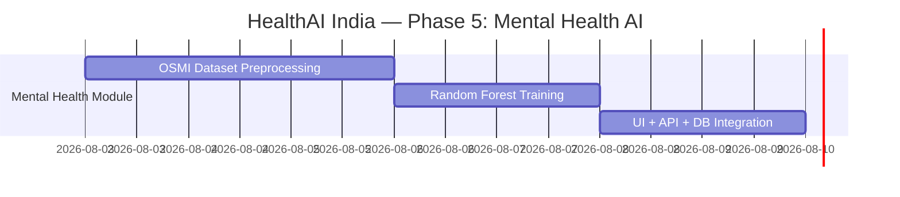

**Deliverable**: + Mental Health — fully working.

---

### Phase 6: Sleep Health Assessment (Final MVP)

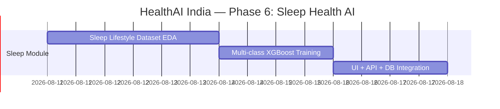

**Deliverable**: Complete Healthcare AI Platform — all 6 modules working.

**Repository**: Final Version — Complete platform.

---

### Future Phase: AI Intelligence Layer

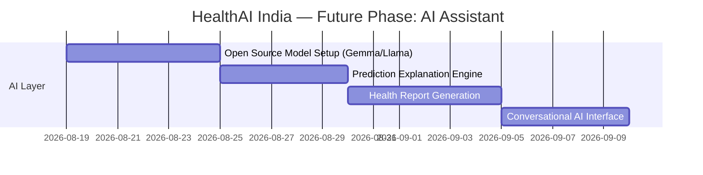

---

### Power BI Analytics Integration

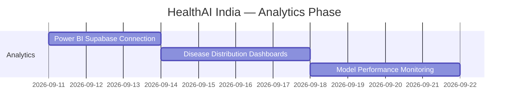

---

## 📈 10. Success Metrics (KPIs)

### ML Model Performance

| Metric | Target | Measurement Method |
|:---|:---:|:---|
| F1-Score (Physiological models) | ≥ 0.80 | sklearn classification_report |
| F1-Score (Psychological models) | ≥ 0.75 | sklearn classification_report |
| Stroke Recall (Sensitivity) | ≥ 0.80 | True Positive Rate @ threshold 0.35 |

### Platform Performance

| Metric | Target | Measurement Method |
|:---|:---:|:---|
| API Inference Latency | ≤ 350ms | FastAPI response time middleware |
| Page Load Time | ≤ 2s | Browser performance timing |
| Concurrent Users | 100+ | Uvicorn `--workers 4` |

### Adoption Metrics

| Metric | Target | Measurement Method |
|:---|:---:|:---|
| Anonymous Predictions per Day | 500+ after 3 months | Supabase prediction count |
| Optional Feedback Rate | ≥ 15% | feedback count / prediction count |
| Module Coverage | All 6 modules used | Prediction distribution in Supabase |

---

## ✅ 11. What's In vs. What's Out

| Feature | Status | Notes |
|:---|:---|:---|
| Anonymous health risk predictions | ✅ In (MVP) | All 6 disease modules |
| Human-friendly questionnaires | ✅ In (MVP) | Plain language, auto BMI calculation |
| Supabase anonymous prediction storage | ✅ In (MVP) | Structured for future retraining |
| Power BI analytics dashboards | ✅ In (MVP) | Disease trends, model performance |
| Incremental deployment per module | ✅ In (MVP) | Each phase is a deployable release |
| User login / signup / accounts | ❌ Out (MVP) | Zero-friction access is the priority |
| User profiles / dashboards | ❌ Out (MVP) | No personal data collection |
| Password reset / session management | ❌ Out (MVP) | Not applicable — no auth |
| LLM-powered explanations | ❌ Future Phase | Requires stable ML pipeline first |
| AI health assistant chatbot | ❌ Future Phase | Open-source models (Gemma/Llama) |
| Indian language support | ❌ Long-Term Vision | Hindi, Bengali, Tamil, etc. |
| Indigenous Medical LLM | ❌ Long-Term Vision | Research goal |
| Mobile app (iOS/Android) | ❌ Future Phase | Web-first for MVP |

---

## 📄 Document Alignment

| Document | Focus |
|:---|:---|
| **Idea.md** | Vision, problem statement, future goals, why this matters for India |
| **PRD.md** (this file) | Functional requirements, user flow, questionnaires, prediction modules, incremental releases |
| **TRD.md** | Technical architecture, ML pipeline, Supabase schema, API design, deployment strategy |

---

*HealthAI India — Building a Made in India Healthcare AI Ecosystem*
