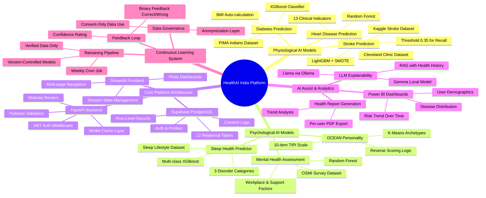
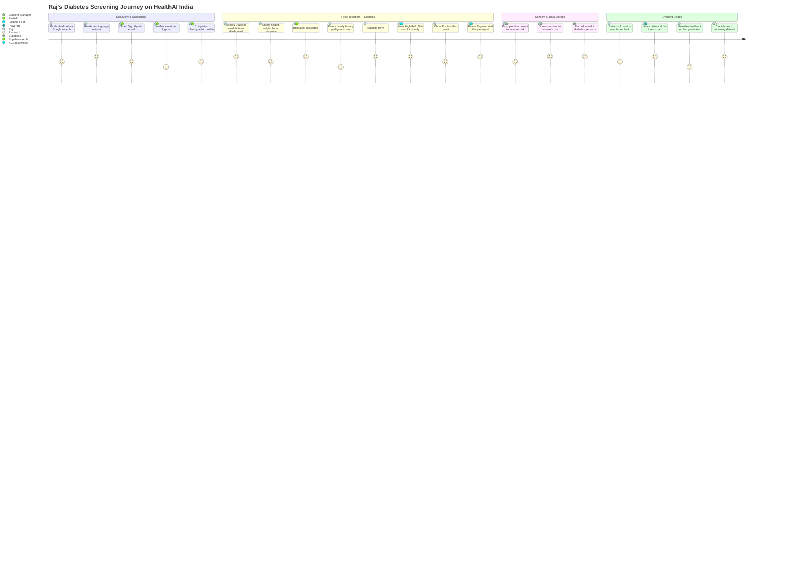
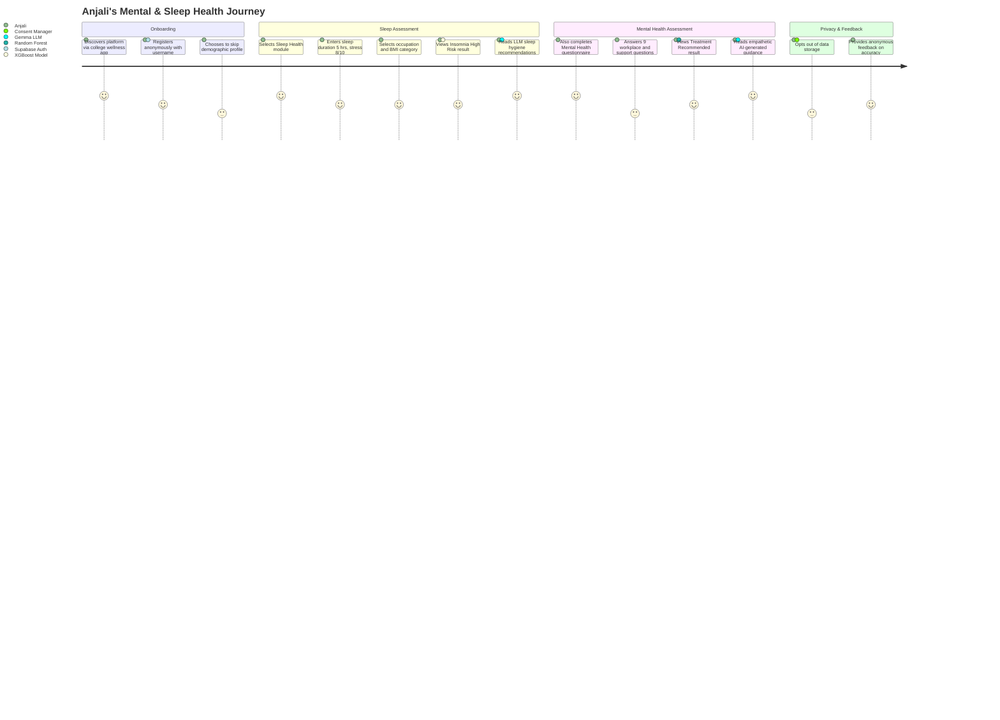
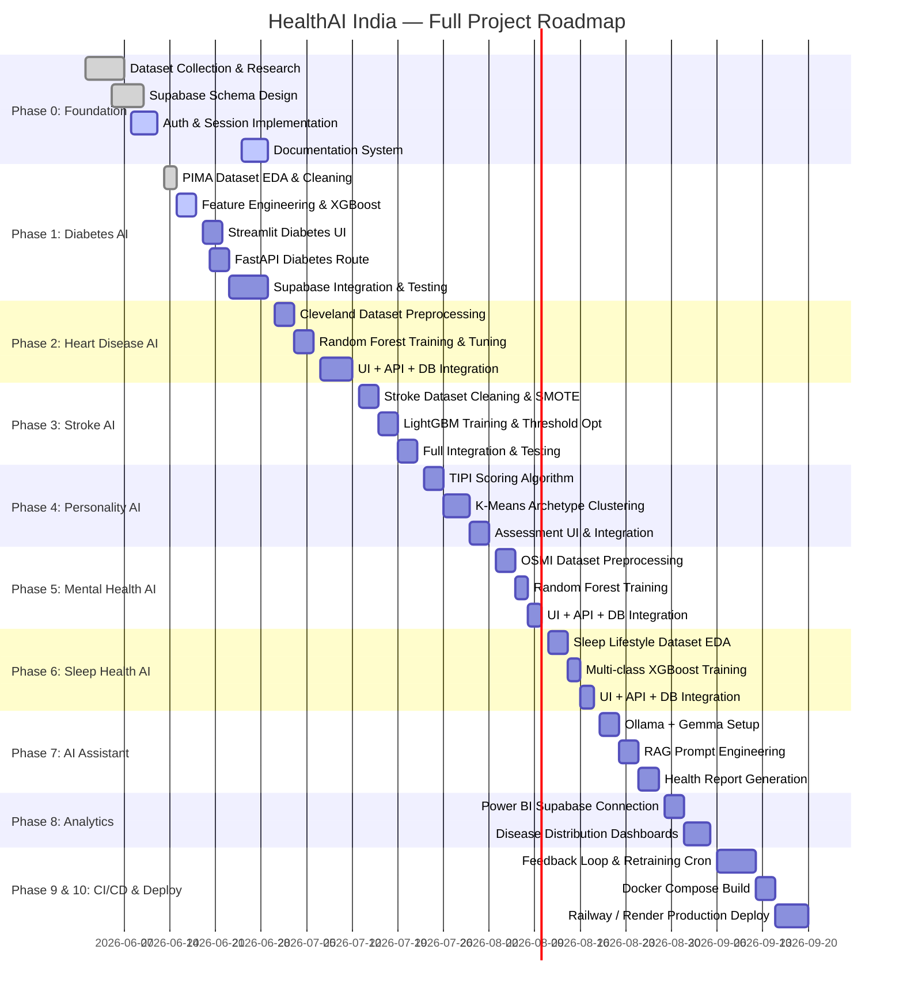
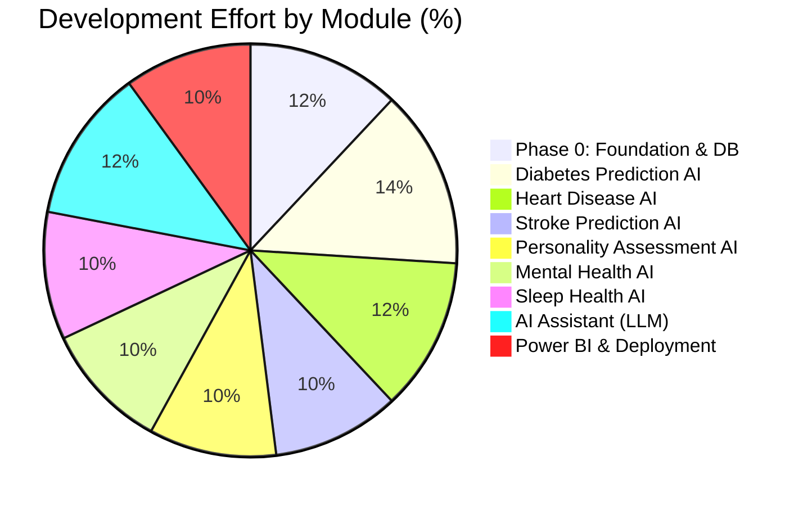

# 📋 Product Requirements Document (PRD) — HealthAI India

HealthAI India is a modular, AI-powered preventive healthcare platform to democratize access to health risk assessments. It combines clinical ML models, psychometric evaluations, LLM-powered explanations, and interactive dashboards.

---

## 🎯 1. Product Vision & Goals

1. **Preventive Risk Analysis**: Early screening for Diabetes, Heart Disease, Stroke.
2. **Holistic Health Mapping**: Mental wellbeing, sleep quality, and personality tracking.
3. **Explainable AI (XAI)**: LLMs (Gemma/Llama) translate model outputs to plain-English recommendations.
4. **Consented Health Registry**: Strict user ownership with consent logging in Supabase.
5. **Continuous Improvement**: Citizen-science data flywheel — user feedback retrains models.

---

## 🧠 2. Product Architecture & Feature Mindmap

---

## 👥 3. User Personas & Journey Maps

### Persona 1: Raj (42, Software Engineer)
- **Need**: Family history of diabetes; wants frictionless self-screening.
- **Behavior**: High digital literacy, values privacy, seeks direct explanations.

### Persona 2: Dr. Priya (38, General Physician)
- **Need**: Wants a second-opinion screening tool for patients with limited lab access.
- **Behavior**: Trusts data, wants to see model confidence and feature importance.

### Persona 3: Anjali (26, Graduate Student)
- **Need**: Experiencing sleep disruption and anxiety; wants holistic mental + sleep assessment.
- **Behavior**: Prefers conversational UI, concerned about data privacy.

---

### User Journey: Raj — Diabetes Self-Screening

---

### User Journey: Anjali — Mental Health + Sleep Assessment

---

## 📅 4. Roadmap & Gantt Diagram

---

## 📊 5. Feature Effort Allocation & Risk Distribution

### Development Effort Allocation

---

## 📈 6. Success Metrics (KPIs)

| Metric | Target | Measurement Method |
|:---|:---:|:---|
| F1-Score (Physiological models) | ≥ 0.80 | sklearn classification_report |
| F1-Score (Psychological models) | ≥ 0.75 | sklearn classification_report |
| Stroke Recall (Sensitivity) | ≥ 0.80 | True Positive Rate @ threshold 0.35 |
| API Inference Latency | ≤ 350ms | FastAPI response time middleware |
| LLM First Token Latency | ≤ 1.5s | Streamlit timer |
| User Feedback Rate | ≥ 15% | Supabase feedback count / prediction count |
| DAU (Daily Active Users) | 500+ after 3 months | Supabase auth logs |
| Consent Grant Rate | ≥ 70% | consent_logs table |
