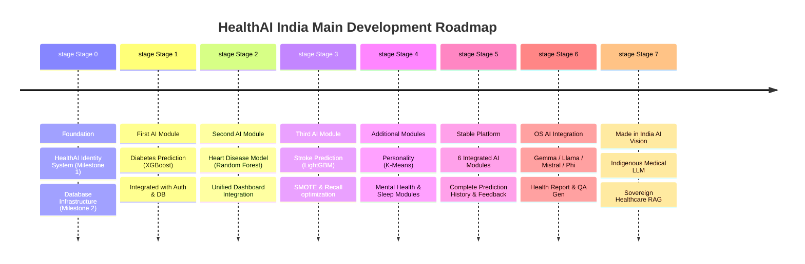

# 📋 Product Requirements Document (PRD) — HealthAI India

HealthAI India is an indigenous, AI-powered preventive healthcare platform developed in India with the long-term vision of becoming a **Made in India Healthcare AI Ecosystem**. 

Unlike simple prediction tools, HealthAI India integrates a secure, location-based identity framework (HealthAI ID) with clinical-grade machine learning models to provide secure longitudinal health tracking.

---

## 📌 Table of Contents

1. [Product Vision & Segmentation](#-1-product-vision--segmentation)
2. [Main Development Roadmap](#-2-main-development-roadmap)
3. [🚀 Project Progress Tracker](#-project-progress-tracker)
4. [Authentication & Registration Flows](#-3-authentication--registration-flows)
5. [HealthAI ID System Architecture](#-4-healthai-id-system-architecture)
6. [Updated User Flow](#-5-updated-user-flow)
7. [User Personas & Journey Maps](#-6-user-personas--journey-maps)
8. [Prediction Modules — Functional Requirements](#-7-prediction-modules--functional-requirements)
9. [Human-Friendly Questionnaire Design](#-8-human-friendly-questionnaire-design)
10. [Database Architecture & Supabase Tables](#-9-database-architecture--supabase-tables)
11. [Detailed Phase-Wise Implementation Plan](#-10-detailed-phase-wise-implementation-plan)
12. [Success Metrics & KPIs](#-11-success-metrics--kpis)
13. [What's In vs. What's Out](#-12-whats-in-vs-whats-out)

---

## 🎯 1. Product Vision & Segmentation

HealthAI India enforces a strict separation of timeline scopes to deliver value immediately while planning for national scale:

### MVP (Current Version)
* **Mandatory Authentication**: Secure phone-number-based registration and login system.
* **Geographical Identity**: Automatic generation of the permanent HealthAI ID.
* **Dashboard & History**: Logged-in user home dashboard listing personal prediction logs over time.
* **6 ML Engines**: Core risk assessment engines powered by traditional machine learning algorithms (XGBoost, RandomForest, LightGBM, K-Means).
* **Human-Friendly Inputs**: Interactive, non-technical questionnaires.

### Intermediate Versions
* **Explainable AI (Stage 2)**: Integration of fine-tuned open-source models (Gemma, Llama, Mistral, Phi) to provide text-based risk explanations and generate PDF health reports.

### Long-Term Vision
* **Sovereign India AI Stack (Stage 3)**: Indigenous Medical LLM trained on local clinical datasets, RAG engines using Indian medical knowledge bases, regional language translations, and continuous, consent-based model retraining pipelines.

---

## 🏁 2. Main Development Roadmap

This high-level roadmap outlines the development plan of HealthAI India from Day 1 to the long-term sovereign AI stack.



### 🚩 Stage 0 — Foundation
#### Milestone 1 — HealthAI Identity System
* Establish state, district, and city codes for regional mapping.
* Define format for the permanent, unique HealthAI ID (e.g. `WB-01-0001-XXXXX`).
* Document registration sequence and prepare backend database constraints.
* *Note: The specific generation algorithm is a future development task. Only the framework, ID schema, and location mapping are configured at this stage.*

#### Milestone 2 — Database Infrastructure
* Configure Supabase PostgreSQL database tables.
* Design authentication schema and test user registration flows.
* Implement user profile creations, setting up the basic dashboard.
* *Outcome*: Users can register, log in, view their dashboard, and obtain their HealthAI ID. No prediction modules are present.

### 🚩 Stage 1 — First AI Module
* Train and optimize the Diabetes Prediction XGBoost model using the PIMA dataset.
* Create a dedicated FastAPI endpoint and Streamlit page.
* Integrate database writes to log inputs and outputs under the authenticated user.
* *Deliverable*: Version 1 (Authentication + Supabase + Diabetes AI).

### 🚩 Stage 2 — Second AI Module
* Train and integrate the Heart Disease model (Random Forest) using the Cleveland clinic dataset.
* Merge routes and update the unified dashboard.
* *Deliverable*: Version 2 (Authentication + Supabase + Diabetes + Heart Disease).

### 🚩 Stage 3 — Third AI Module
* Preprocess and balance the Stroke dataset (SMOTE).
* Train a LightGBM model and optimize the decision threshold to 0.35.
* Integrate and deploy.
* *Deliverable*: Version 3 (Authentication + Supabase + Diabetes + Heart Disease + Stroke).

### 🚩 Stage 4 — Additional AI Modules
* Incrementally train, test, and integrate the `Personality`, `Mental Health`, and `Sleep Health` engines.

### 🚩 Stage 5 — Complete Healthcare Platform
* Launch the first stable release of HealthAI India with all 6 AI modules, longitudinal history, dashboard trends, and user feedback logs.

### 🚩 Stage 6 — Open Source AI Integration
* Integrate local open-source LLMs (Gemma, Llama, Mistral, Phi) to complement the ML models, acting as the narrative explanation, health report, and QA assistant.

### 🚩 Stage 7 — Made in India AI Vision
* Long-term research stack: Indigenous Medical LLMs, RAG engines using Indian Clinical Guidelines, regional language support, and continuous learning systems.

---

## 🚀 Project Progress Tracker

## Foundation
- [ ] Collect datasets
- [ ] Study codebooks
- [ ] Create Data Dictionaries
- [ ] Design Database
- [ ] Configure Supabase
- [ ] Build Authentication
- [ ] Generate HealthAI ID

## Diabetes AI
- [ ] Data Cleaning
- [ ] Feature Engineering
- [ ] Model Training
- [ ] Evaluation
- [ ] Frontend
- [ ] Backend
- [ ] Supabase Integration
- [ ] Testing

## Heart Disease AI
- [ ] Dataset
- [ ] Training
- [ ] Evaluation
- [ ] Integration

## Stroke AI
- [ ] Dataset
- [ ] Training
- [ ] Evaluation
- [ ] Integration

## Personality AI
- [ ] Dataset
- [ ] Training
- [ ] Integration

## Mental Health AI
- [ ] Dataset
- [ ] Training
- [ ] Integration

## Sleep Health AI
- [ ] Dataset
- [ ] Training
- [ ] Integration

## AI Assistant
- [ ] Open Source Model
- [ ] Fine Tuning
- [ ] Health Report Generation

## Deployment
- [ ] Backend
- [ ] Frontend
- [ ] Docker
- [ ] Production Deployment

---

## 🔑 3. Authentication & Registration Flows

To track longitudinal predictions securely, authentication is a mandatory core requirement of the application.

### Registration flow:
```text
State Selection
      ↓
District Selection
      ↓
City Selection
      ↓
Phone Number (Primary Key)
      ↓
Full Name
      ↓
Date of Birth
      ↓
Password
      ↓
Confirm Password
      ↓
Generate Unique HealthAI ID (Backend)
      ↓
Account Created successfully
```

### Login flow:
Returning users log in using:
* **Phone Number**
* **Password**

*Note: No email or username login is supported. The phone number serves as the primary, unique identity.*

---

## 🪪 4. HealthAI ID System Architecture

Each registered user receives a permanent **HealthAI ID** which serves as their sovereign health identifier.

### ID Structure
```text
WB-01-0001-XXXXX
```
* **State Code** (e.g., `WB` for West Bengal)
* **District Code** (e.g., `01` for Darjeeling)
* **City Code** (e.g., `0001` for Siliguri)
* **Sequential User Identifier** (`XXXXX` sequential integer assigned dynamically by backend)

*Note: The core backend algorithm responsible for generating the sequential user identifier and syncing records will be developed separately. The PRD establishes its inputs, structural constraints, and mapping roles.*

---

## 🔄 5. Updated User Flow

The application workflow transitions from an anonymous model to a secure, account-based system:

```text
User
  ↓
Register (Input State, District, City, Phone, Name, DOB, Password)
  ↓
Login (Phone Number + Password)
  ↓
Dashboard (View personal HealthAI ID, past risk history, and trends)
  ↓
Select Disease Module (Diabetes, Heart, Stroke, Personality, Mental Health, Sleep)
  ↓
Fill Questionnaire (Human-friendly inputs)
  ↓
ML Prediction (Backend performs scaling and inference)
  ↓
Store Prediction (Record logs, outputs, and user consent)
  ↓
Supabase Database
  ↓
Prediction History (Logs updated on user dashboard)
  ↓
Future Model Retraining (Consented data periodically retrained)
```

---

## 👥 6. User Personas & Journey Maps

### Persona 1: Raj (42, Software Engineer in Bengaluru)
* **Need**: Family history of diabetes; wants to securely track his cardiovascular and diabetic risk indicators every 3 months.
* **Behavior**: Tech-savvy, wants to verify data security and see his history over time.
* **Journey**: Visits portal -> Registers with location, phone, and password -> Receives HealthAI ID -> Logs in -> Fills Diabetes form -> Views High Risk result -> Selects to save -> Sees updated dashboard.

### Persona 2: Dr. Priya (38, General Physician in Siliguri)
* **Need**: Wants to recommend a secure, structured health-tracking platform to patients with limited local laboratory access.
* **Behavior**: Clinical expert, values structured IDs for regional health statistics.
* **Journey**: Views dashboard trends -> Directs patient to sign up with their city code -> Reviews patient's history logs during consults.

---

## 🩺 7. Prediction Modules — Functional Requirements

The core platform features 6 machine learning models:

### 1. Diabetes Prediction
* **Dataset**: PIMA Indians Diabetes Dataset.
* **Model**: XGBoost Classifier.
* **Inputs**: Glucose, Blood Pressure, Skin Thickness, Insulin, Height, Weight, Pedigree Function, Age.
* **Output**: Risk classification + probability confidence score.

### 2. Heart Disease Prediction
* **Dataset**: Cleveland Clinic Heart Disease Dataset.
* **Model**: Random Forest Classifier.
* **Inputs**: Chest pain type, Resting blood pressure, Cholesterol, Fasting blood sugar, resting ECG, max heart rate, angina, etc.
* **Output**: Risk classification + probability confidence score.

### 3. Stroke Prediction
* **Dataset**: Kaggle Stroke Dataset.
* **Model**: LightGBM + SMOTE (optimized for recall at a decision threshold of 0.35).
* **Inputs**: Hypertension, heart disease, marital status, work type, average glucose, height, weight, smoking.
* **Output**: Recall-optimized stroke risk assessment.

### 4. Personality Assessment
* **Scale**: Ten-Item Personality Inventory (TIPI).
* **Model**: K-Means clustering.
* **Inputs**: 10 scale questions (1-7 Likert scale).
* **Output**: Archetype assignment + OCEAN traits breakdown.

### 5. Mental Health Assessment
* **Dataset**: OSMI Survey.
* **Model**: Random Forest Classifier.
* **Inputs**: Family history, workplace support, care access, wellness benefits.
* **Output**: Recommendation for treatment (Yes/No).

### 6. Sleep Health Predictor
* **Dataset**: Sleep Lifestyle Dataset.
* **Model**: Multi-class XGBoost.
* **Inputs**: Sleep duration, quality, physical activity, stress level, blood pressure, heart rate, daily steps.
* **Output**: Multi-class categorization of sleep disorder risk (None, Insomnia, Sleep Apnea).

---

## 📝 8. Human-Friendly Questionnaire Design

To prevent confusion, raw dataset column names are completely abstracted.

| ❌ Never Show This | ✅ Show This Instead |
|:---|:---|
| `GenHlth` (scale 1-5) | "How would you rate your overall health?" (Excellent / Very Good / Good / Fair / Poor) |
| `BMI` (raw float) | "What is your height in cm?" and "What is your weight in kg?" (BMI calculated internally) |
| `FBS > 120` | "Is your fasting blood sugar level above 120 mg/dL?" (Yes / No) |
| `HighBP` | "Have you been diagnosed with high blood pressure?" (Yes / No) |

---

## 🗄️ 9. Database Architecture & Supabase Tables

All records are tied to the authenticated user account. The Supabase database stores registration details, location markers, predictions, and clinical values:

```text
users (Supabase native authentication schema)
  ↓
user_profiles (Tied to user_id, stores full_name, dob, phone, HealthAI ID, state, district, city)
  ↓
predictions (Tied to user_profile, stores timestamp, disease_type, risk_probability, label)
  ↓
feedback (Tied to prediction_id, user feedback and comments)
  ↓
consent_logs (Tied to user_id, stores privacy consent logs)
  ↓
disease_records (Tied to prediction_id, stores the actual inputs)
   ├── diabetes_records
   ├── heart_records
   ├── stroke_records
   ├── personality_records
   ├── mental_health_records
   └── sleep_records
```

---

## 📅 10. Detailed Phase-Wise Implementation Plan

The project development must follow the detailed phase roadmap:

### Phase 0: Foundation
* Supabase schemas, users setup, geographic tables, and HealthAI ID definition.

### Phase 1: Diabetes Prediction
* EDA, XGBoost training, frontend form, and FastAPI backend routes.

### Phase 2: Heart Disease Prediction
* Preprocessing, Random Forest training, and dashboard integration.

### Phase 3: Stroke Prediction
* LightGBM training + SMOTE, 0.35 threshold adjustment.

### Phase 4: Personality Assessment
* K-Means archetype clustering.

### Phase 5: Mental Health Assessment
* OSMI processing, Random Forest training.

### Phase 6: Sleep Health Assessment
* Multi-class XGBoost implementation.

### Phase 7: LLM Assistant (Future Phase)
* Ollama/Gemma integration, report generation, and explanation streaming.

---

## 📈 11. Success Metrics & KPIs

* **Clinical Accuracy**: F1-Score $\geq$ 0.80 for physiological models; Stroke Recall $\geq$ 0.80.
* **System Latency**: API inference return time $\leq$ 350ms.
* **Platform Security**: 100% of prediction records verified with RLS based on `user_id = auth.uid()`.

---

## ✅ 12. What's In vs. What's Out

| Feature | Status | Notes |
|:---|:---:|:---|
| Mandatory phone registration & login | ✅ In | Replaces anonymous entry. Core first module. |
| Automatic HealthAI ID Generation | ✅ In | Based on geography and signup sequence. |
| 6 ML Prediction Modules | ✅ In | Traditional Python ML engines. |
| Longitudinal User Dashboard | ✅ In | Tracks history over time. |
| AI Health Assistant (Generative) | ❌ Out (MVP) | Deferred to Stage 6 (Open Source LLMs). |
| Native Multilingual translation | ❌ Out (MVP) | Deferred to Stage 7 (Long-Term sovereign stack). |
