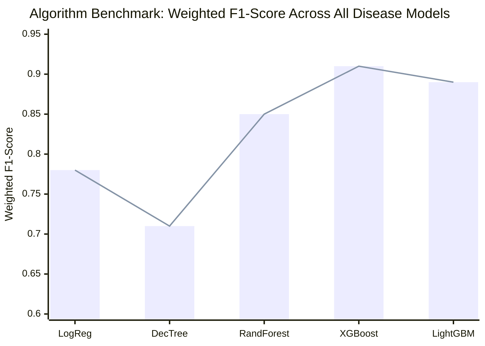
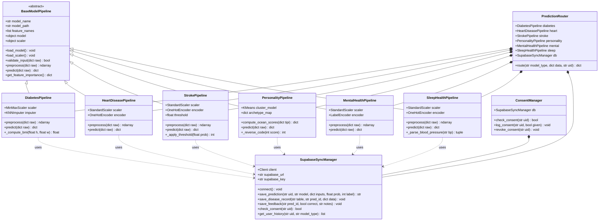
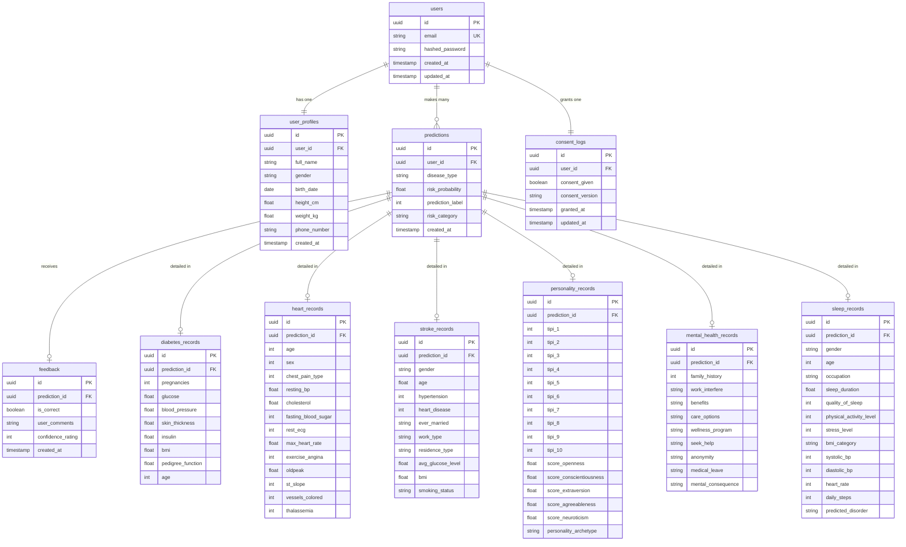
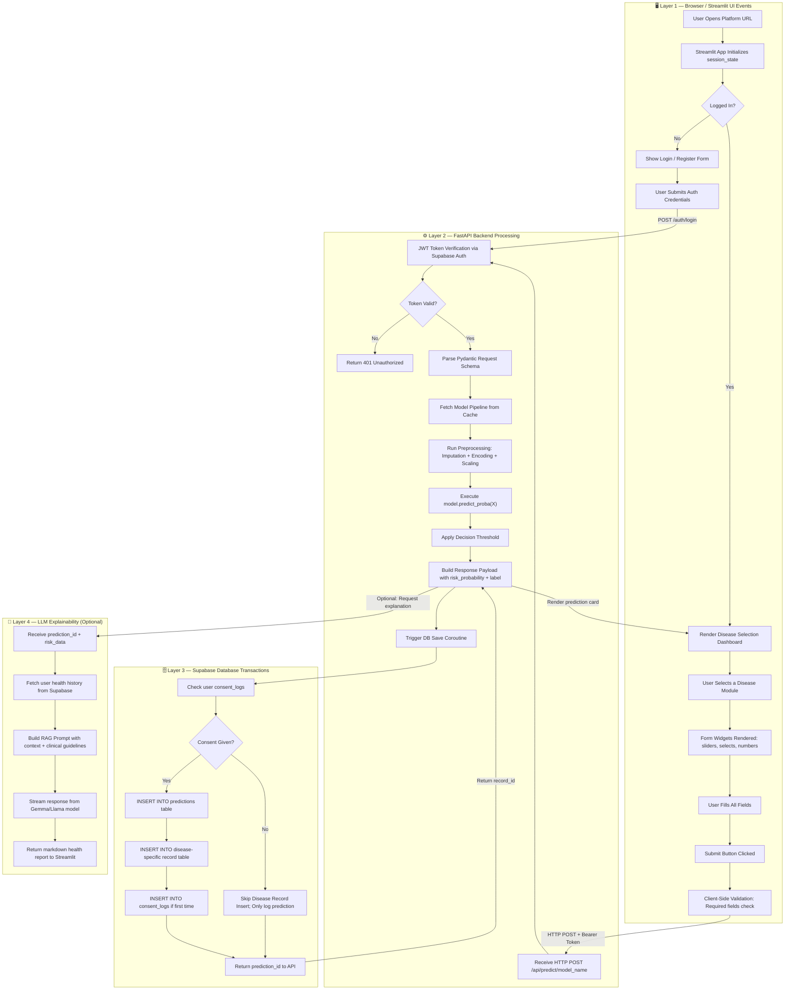
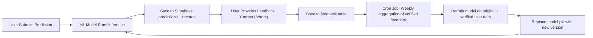

# 📖 Theory, Libraries & Scientific Foundation — HealthAI India

This document is the **complete scientific backbone** of the HealthAI India platform. It covers the mathematics of every algorithm used, the OOP class structure, the full database ERD, preprocessing theory, evaluation metrics, Supabase integration theory, and all libraries with usage patterns.

---

## 📚 1. Machine Learning Algorithms & Mathematical Foundations

### 1.1 Logistic Regression

**Use Case**: Baseline binary classifier for Diabetes & Stroke.

The Sigmoid activation maps any real-valued linear combination $z$ to a probability $\hat{y} \in (0,1)$:

$$\sigma(z) = \frac{1}{1 + e^{-z}}, \quad z = \mathbf{\theta}^T \mathbf{x} = \theta_0 + \theta_1 x_1 + \dots + \theta_n x_n$$

**Decision Rule**: If $\sigma(z) \geq 0.5$ → Class 1 (High Risk), else Class 0 (Low Risk).

**Loss Function** — Binary Cross-Entropy (Log Loss):

$$J(\theta) = -\frac{1}{m} \sum_{i=1}^{m} \left[ y^{(i)} \log(\hat{y}^{(i)}) + (1 - y^{(i)}) \log(1 - \hat{y}^{(i)}) \right]$$

**Gradient Descent Update Rule**:

$$\theta_j := \theta_j - \alpha \frac{\partial J}{\partial \theta_j} = \theta_j - \frac{\alpha}{m} \sum_{i=1}^{m} (\hat{y}^{(i)} - y^{(i)}) x_j^{(i)}$$

**Regularization** (L2 Ridge):

$$J_{reg}(\theta) = J(\theta) + \frac{\lambda}{2m} \sum_{j=1}^{n} \theta_j^2$$

**Hyperparameters used**: `C=1.0` (inverse regularization), `solver='lbfgs'`, `max_iter=1000`

---

### 1.2 Decision Tree Classifier

**Use Case**: Interpretable baseline; used as a weak learner in ensemble methods.

**Splitting Criterion — Gini Impurity**:

$$I_G(t) = 1 - \sum_{k=1}^{K} p_k^2$$

Where $p_k$ = fraction of samples of class $k$ at node $t$.

**Information Gain (Entropy-based splitting)**:

$$H(t) = -\sum_{k=1}^{K} p_k \log_2(p_k)$$

$$IG(t, A) = H(t) - \sum_{v \in \text{values}(A)} \frac{|S_v|}{|S|} H(S_v)$$

**Pruning**: `max_depth`, `min_samples_split`, `min_samples_leaf` prevent overfitting on clinical data.

---

### 1.3 Random Forest Classifier

**Use Case**: Heart Disease, Mental Health prediction — robust against noisy clinical data.

Random Forest builds $B$ decision trees using:

1. **Bootstrap Aggregation (Bagging)**: Each tree $T_b$ is trained on $D_b$ — a bootstrap sample of $n$ data points drawn with replacement from the original dataset.

2. **Feature Subspace Sampling**: At each split, only $m = \lfloor\sqrt{p}\rfloor$ features are considered (where $p$ = total features), ensuring decorrelated trees.

**Final Prediction (Majority Voting)**:

$$\hat{y} = \text{argmax}_k \sum_{b=1}^{B} \mathbf{1}[T_b(\mathbf{x}) = k]$$

**Out-of-Bag (OOB) Error**: Samples not selected in bootstrap for tree $T_b$ are used as a free validation set. OOB error ≈ generalization error.

**Variable Importance (MDI)**:

$$VI(X_j) = \frac{1}{B} \sum_{b=1}^{B} \sum_{t \in T_b} \Delta I(t, X_j) \cdot p(t)$$

Where $\Delta I(t, X_j)$ is the decrease in impurity from splitting on feature $X_j$ at node $t$ and $p(t) = n_t / n$.

**Hyperparameters**: `n_estimators=200`, `max_depth=12`, `min_samples_leaf=2`, `class_weight='balanced'`

---

### 1.4 XGBoost (Extreme Gradient Boosting)

**Use Case**: Diabetes, Sleep Health prediction — best accuracy on tabular clinical data.

XGBoost trains trees additively. At iteration $t$, objective function:

$$\mathcal{L}^{(t)} = \sum_{i=1}^n l(y_i, \hat{y}_i^{(t-1)} + f_t(x_i)) + \Omega(f_t)$$

Using second-order Taylor expansion:

$$\mathcal{L}^{(t)} \approx \sum_{i=1}^n \left[ g_i f_t(x_i) + \frac{1}{2} h_i f_t^2(x_i) \right] + \Omega(f_t)$$

Where:
- $g_i = \partial_{\hat{y}^{(t-1)}} l(y_i, \hat{y}^{(t-1)})$ → first-order gradient
- $h_i = \partial^2_{\hat{y}^{(t-1)}} l(y_i, \hat{y}^{(t-1)})$ → second-order hessian

**Regularization Term**:

$$\Omega(f_t) = \gamma T + \frac{1}{2}\lambda \sum_{j=1}^{T} w_j^2$$

Where $T$ = number of leaves, $w_j$ = leaf weights. $\gamma$ penalizes extra leaves, $\lambda$ penalizes large weights.

**Optimal Leaf Weight**:

$$w_j^* = -\frac{\sum_{i \in I_j} g_i}{\sum_{i \in I_j} h_i + \lambda}$$

**Hyperparameters**: `n_estimators=300`, `max_depth=6`, `learning_rate=0.05`, `subsample=0.8`, `colsample_bytree=0.8`, `use_label_encoder=False`, `eval_metric='logloss'`

---

### 1.5 LightGBM (Light Gradient Boosting Machine)

**Use Case**: Stroke prediction — optimized for speed on imbalanced datasets.

LightGBM introduces two key innovations over standard boosting:

**Gradient-based One-Side Sampling (GOSS)**:
Retains all high-gradient instances and randomly samples a fraction of low-gradient instances, weighted to preserve the data distribution:

$$\tilde{\mathcal{L}}^{(t)} \approx \frac{1}{n} \left[ \sum_{i \in A} l(y_i, F(x_i)) + \frac{1-a}{b} \sum_{i \in B} l(y_i, F(x_i)) \right]$$

**Exclusive Feature Bundling (EFB)**: Bundles mutually exclusive sparse features (features that rarely take nonzero values simultaneously) into single features, reducing dimensionality $O(p)$ → $O(b)$.

**Leaf-wise Growth**: Unlike level-wise trees (XGBoost), LightGBM splits the leaf with maximum delta loss, achieving lower loss with fewer splits:

$$\Delta_{split} = \frac{1}{2} \left[ \frac{G_L^2}{H_L + \lambda} + \frac{G_R^2}{H_R + \lambda} - \frac{G^2}{H + \lambda} \right] - \gamma$$

**Hyperparameters**: `n_estimators=500`, `num_leaves=63`, `learning_rate=0.03`, `min_child_samples=20`, `class_weight='balanced'`, `is_unbalance=True`

---

### 1.6 K-Means Clustering (Personality Archetype Assignment)

**Use Case**: Personality model — clusters OCEAN scores into behavioral archetypes.

K-Means minimizes the within-cluster sum of squared Euclidean distances:

$$J = \sum_{k=1}^{K} \sum_{x_i \in C_k} \| x_i - \mu_k \|^2$$

**Algorithm (Lloyd's)**:
1. Initialize $K$ centroids $\mu_1, \dots, \mu_K$ (using K-Means++ for stable initialization)
2. **Assignment Step**: $C_k = \{ x_i : \| x_i - \mu_k \|^2 \leq \| x_i - \mu_j \|^2, \forall j \}$
3. **Update Step**: $\mu_k = \frac{1}{|C_k|} \sum_{x_i \in C_k} x_i$
4. Repeat until convergence ($\Delta J < \epsilon$)

**Choosing K**: Elbow method — plot $J$ vs $K$, choose the elbow point (K=4 for OCEAN archetypes).

**Silhouette Score** (validation):

$$s(i) = \frac{b(i) - a(i)}{\max\{a(i), b(i)\}}$$

Where $a(i)$ = mean intra-cluster distance, $b(i)$ = mean nearest-cluster distance.

---

### 1.7 KNN Imputation

**Use Case**: Filling missing physiological values (Glucose, BMI, Insulin) before model inference.

For a missing feature $x_j$ in sample $i$, KNN Imputer:
1. Finds the $K$ nearest non-missing neighbors using **Euclidean distance on non-missing features**
2. Imputes: $\hat{x}_{ij} = \frac{1}{K} \sum_{k \in \mathcal{N}(i)} x_{kj}$

**Distance metric used**: $d(a, b) = \sqrt{\sum_{f \in F_{obs}} (a_f - b_f)^2}$ where $F_{obs}$ = observed (non-missing) features.

**Parameters**: `n_neighbors=5`, `weights='uniform'`

---

### 1.8 SMOTE (Synthetic Minority Over-Sampling Technique)

**Use Case**: Stroke dataset rebalancing (~5% positive class).

SMOTE generates synthetic minority samples along the feature-space line segments between existing minority samples:

$$x_{new} = x_i + \delta \cdot (x_{nn} - x_i), \quad \delta \sim \text{Uniform}(0,1)$$

Where $x_{nn}$ is a randomly selected K-nearest neighbor of $x_i$ from the minority class.

**Applied only during training** — production inference uses the trained model directly on unmodified input.

---

### 1.9 Feature Scaling

**MinMaxScaler** (used for Diabetes — bounded clinical features):

$$x_{scaled} = \frac{x - x_{min}}{x_{max} - x_{min}}$$

**StandardScaler** (used for Heart, Stroke, Mental Health, Sleep — normally distributed features):

$$x_{scaled} = \frac{x - \mu}{\sigma}$$

Both scalers are **fit on training data only** and saved alongside the `.pkl` model file. At inference, only `transform()` is called (never `fit_transform()`).

---

## 📊 2. Model Algorithm Benchmarks

### 2.1 Cross-Model F1-Score Comparison



### 2.2 Model Evaluation Metrics — Full Mathematical Reference

**Confusion Matrix Definitions**:

| Metric | Formula | Clinical Meaning |
|:---|:---|:---|
| **Accuracy** | $\frac{TP + TN}{TP + TN + FP + FN}$ | Overall correct predictions |
| **Precision** | $\frac{TP}{TP + FP}$ | Of predicted positives, how many are truly positive |
| **Recall (Sensitivity)** | $\frac{TP}{TP + FN}$ | Of actual positives, how many were caught (critical for Stroke) |
| **Specificity** | $\frac{TN}{TN + FP}$ | Of actual negatives, how many were correctly identified |
| **F1-Score** | $\frac{2 \cdot P \cdot R}{P + R}$ | Harmonic mean of Precision & Recall |
| **ROC-AUC** | $\int_0^1 TPR(FPR^{-1}(t)) dt$ | Area under TPR vs FPR curve; 1.0 = perfect |
| **MCC** | $\frac{TP \cdot TN - FP \cdot FN}{\sqrt{(TP+FP)(TP+FN)(TN+FP)(TN+FN)}}$ | Best metric for imbalanced datasets |

---

## 🗂️ 3. Class Diagram — Complete OOP Architecture

The platform's Python classes follow a strict inheritance and composition pattern to maximize reusability and testability.



---

## 🗄️ 4. Complete Database Entity Relationship Diagram (ERD)

Full Supabase PostgreSQL schema covering all 6 disease models, consent management, and feedback:



---

## 🔄 5. Multi-Layer Event Modeling

A complete 4-layer event propagation model from browser interaction to Supabase commit:



---

## 🧠 6. Supabase Integration Theory

### 6.1 Row Level Security (RLS) Architecture

Supabase RLS uses PostgreSQL's native policy engine. Every table has:

```sql
-- Enable RLS
ALTER TABLE predictions ENABLE ROW LEVEL SECURITY;

-- SELECT: Users can only see their own rows
CREATE POLICY "user_select_own" ON predictions
  FOR SELECT USING (user_id = auth.uid());

-- INSERT: Users can only insert their own rows
CREATE POLICY "user_insert_own" ON predictions
  FOR INSERT WITH CHECK (user_id = auth.uid());
```

`auth.uid()` resolves the user UUID from the **JWT Bearer token** sent with each API call, making it impossible for User A to read User B's records even with direct SQL access.

### 6.2 Supabase Python Client Pattern

```python
from supabase import create_client, Client

# Initialize once at app startup
supabase: Client = create_client(SUPABASE_URL, SUPABASE_KEY)

# Authenticated request using user JWT
def save_prediction(user_jwt: str, data: dict) -> str:
    client = create_client(SUPABASE_URL, SUPABASE_KEY)
    client.auth.set_session(access_token=user_jwt, refresh_token="")
    result = client.table("predictions").insert(data).execute()
    return result.data[0]["id"]
```

### 6.3 Continuous Learning Data Flywheel

Every user interaction feeds back into the system:



---

## 🛠️ 7. Complete Library & Package Reference

| Package | Version | Purpose | Key APIs Used |
|:---|:---:|:---|:---|
| `scikit-learn` | 1.3.x | ML pipelines, preprocessing, baseline models | `RandomForestClassifier`, `LogisticRegression`, `MinMaxScaler`, `StandardScaler`, `KNNImputer`, `OneHotEncoder`, `LabelEncoder`, `KMeans`, `train_test_split`, `classification_report`, `roc_auc_score` |
| `xgboost` | 2.0.x | Gradient boosted trees for tabular data | `XGBClassifier`, `predict_proba`, `feature_importances_`, `DMatrix` |
| `lightgbm` | 4.1.x | Fast leaf-wise boosting for imbalanced data | `LGBMClassifier`, `is_unbalance=True`, `early_stopping`, `log_evaluation` |
| `imbalanced-learn` | 0.11.x | SMOTE oversampling for Stroke dataset | `SMOTE`, `SMOTETomek`, `Pipeline` |
| `joblib` | 1.3.x | Model serialization / deserialization | `dump(model, path)`, `load(path)` |
| `pandas` | 2.1.x | Data loading, cleaning, transformation | `read_csv`, `fillna`, `get_dummies`, `DataFrame` |
| `numpy` | 1.26.x | Numerical computation | `array`, `reshape`, `where`, `nan` |
| `fastapi` | 0.109.x | Async REST API gateway | `FastAPI`, `APIRouter`, `Depends`, `HTTPException`, `BackgroundTasks` |
| `pydantic` | 2.6.x | Request/response validation schemas | `BaseModel`, `Field`, `validator`, `model_validator` |
| `uvicorn` | 0.27.x | ASGI server for FastAPI | `uvicorn.run`, `--workers`, `--reload` |
| `supabase` | 2.3.x | Supabase DB + Auth Python client | `create_client`, `table().insert()`, `table().select()`, `auth.sign_in_with_password()`, `auth.get_user()` |
| `python-jose` | 3.3.x | JWT decoding and verification | `jwt.decode`, `JWTError` |
| `streamlit` | 1.31.x | Interactive frontend dashboard | `st.form`, `st.slider`, `st.selectbox`, `st.session_state`, `st.plotly_chart`, `st.spinner` |
| `plotly` | 5.18.x | Interactive charts in Streamlit | `px.bar`, `go.Figure`, `go.Indicator` |
| `python-dotenv` | 1.0.x | Environment variable loading | `load_dotenv`, `os.getenv` |
| `httpx` | 0.26.x | Async HTTP client for Streamlit→FastAPI calls | `AsyncClient`, `post`, `get` |
| `pytest` | 7.4.x | Unit and integration testing framework | `pytest.fixture`, `assert`, `monkeypatch` |
| `pytest-asyncio` | 0.23.x | Async test support for FastAPI | `@pytest.mark.asyncio` |
| `ollama` | 0.1.x | Local LLM inference (Gemma/Llama) | `ollama.generate`, `ollama.chat` |
