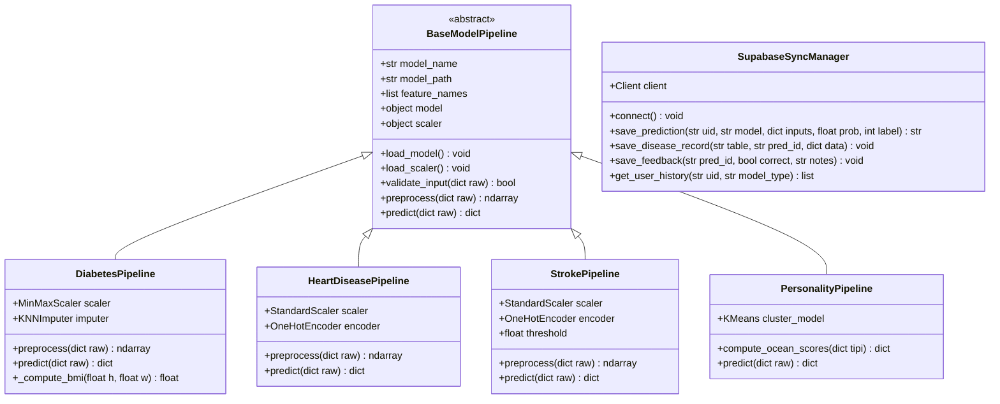
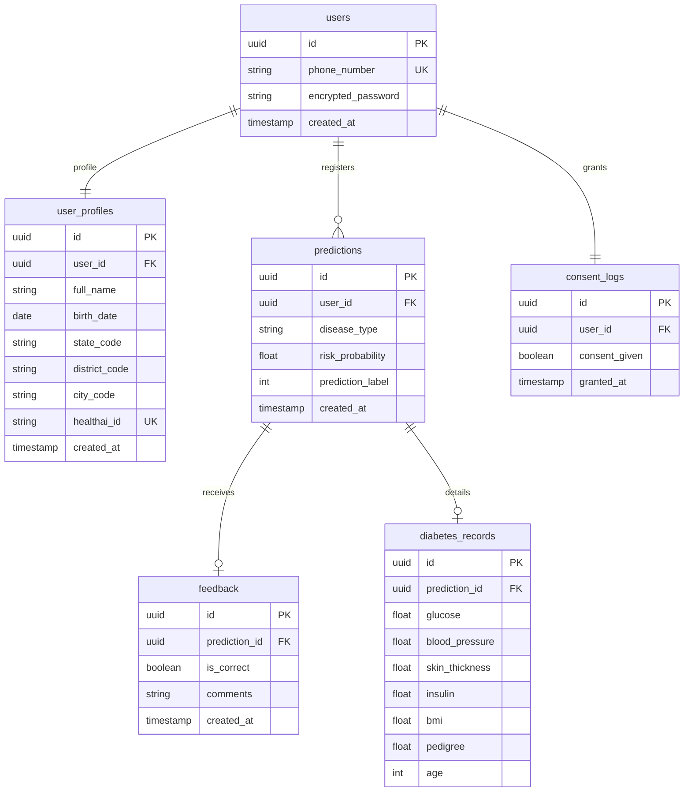
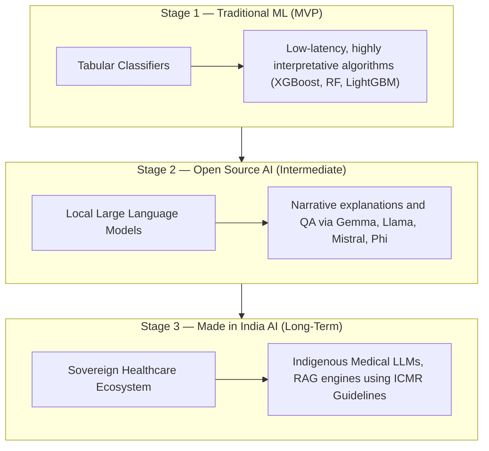

# 📖 Theory, Libraries & Scientific Foundation — HealthAI India

This document serves as the **complete scientific backbone** of the HealthAI India platform. It covers the mathematics of every algorithm used, the OOP class structure, the database ERD, preprocessing theory, evaluation metrics, Supabase integration theory, the geographical HealthAI ID generation scheme, the three-stage machine learning evolution theory, and all libraries with usage patterns.

---

## 📌 Table of Contents

1. [Machine Learning Algorithms & Mathematical Foundations](#1-machine-learning-algorithms--mathematical-foundations)
2. [Model Algorithm Benchmarks & Evaluation Theory](#2-model-algorithm-benchmarks--evaluation-theory)
3. [HealthAI Identity & Authentication Security Theory](#3-healthai-identity--authentication-security-theory)
4. [Class Diagram — Complete OOP Architecture](#4-class-diagram--complete-oop-architecture)
5. [Complete Database Entity Relationship Diagram (ERD)](#5-complete-database-entity-relationship-diagram-erd)
6. [Multi-Layer Event Modeling](#6-multi-layer-event-modeling)
7. [Supabase Integration & RLS Policy Theory](#7-supabase-integration--rls-policy-theory)
8. [Three-Stage Machine Learning Evolution Theory](#8-three-stage-machine-learning-evolution-theory)
9. [Complete Library & Package Reference](#9-complete-library--package-reference)

---

## 1. Machine Learning Algorithms & Mathematical Foundations

### 1.1 Logistic Regression

**Use Case**: Baseline binary classifier for Diabetes & Stroke.

The Sigmoid activation maps any real-valued linear combination $z$ to a probability $\hat{y} \in (0,1)$:

$$\sigma(z) = \frac{1}{1 + e^{-z}}, \quad z = \mathbf{\theta}^T \mathbf{x} = \theta_0 + \theta_1 x_1 + \dots + \theta_n x_n$$

**Decision Rule**: If $\sigma(z) \geq 0.5$ → Class 1 (High Risk), else Class 0 (Low Risk).

**Loss Function** — Binary Cross-Entropy (Log Loss):

$$J(\theta) = -\frac{1}{m} \sum_{i=1}^{m} \left[ y^{(i)} \log(\hat{y}^{(i)}) + (1 - y^{(i)}) \log(1 - \hat{y}^{(i)}) \right]$$

**Gradient Descent Update Rule**:

$$\theta_j := \theta_j - \alpha \frac{\partial J}{\partial \theta_j} = \theta_j - \frac{\alpha}{m} \sum_{i=1}^{m} (\hat{y}^{(i)} - y^{(i)}) x_j^{(i)}$$

**Regularization** (L2 Ridge):

$$J_{reg}(\theta) = J(\theta) + \frac{\lambda}{2m} \sum_{j=1}^{n} \theta_j^2$$

**Hyperparameters**: `C=1.0` (inverse regularization strength), `solver='lbfgs'`, `max_iter=1000`

---

### 1.2 Decision Tree Classifier

**Use Case**: Interpretable baseline; used as a weak learner in ensemble methods.

**Splitting Criterion — Gini Impurity**:

$$I_G(t) = 1 - \sum_{k=1}^{K} p_k^2$$

Where $p_k$ = fraction of samples of class $k$ at node $t$.

**Information Gain (Entropy-based splitting)**:

$$H(t) = -\sum_{k=1}^{K} p_k \log_2(p_k)$$

$$IG(t, A) = H(t) - \sum_{v \in \text{values}(A)} \frac{|S_v|}{|S|} H(S_v)$$

**Pruning**: `max_depth`, `min_samples_split`, `min_samples_leaf` prevent overfitting on clinical data.

---

### 1.3 Random Forest Classifier

**Use Case**: Heart Disease, Mental Health prediction — robust against noisy clinical data.

Random Forest builds $B$ decision trees using:

1. **Bootstrap Aggregation (Bagging)**: Each tree $T_b$ is trained on $D_b$ — a bootstrap sample of $n$ data points drawn with replacement from the original dataset.
2. **Feature Subspace Sampling**: At each split, only $m = \lfloor\sqrt{p}\rfloor$ features are considered (where $p$ = total features), ensuring decorrelated trees.

**Final Prediction (Majority Voting)**:

$$\hat{y} = \text{argmax}_k \sum_{b=1}^{B} \mathbf{1}[T_b(\mathbf{x}) = k]$$

**Out-of-Bag (OOB) Error**: Samples not selected in bootstrap for tree $T_b$ are used as a free validation set. OOB error ≈ generalization error.

**Variable Importance (MDI)**:

$$VI(X_j) = \frac{1}{B} \sum_{b=1}^{B} \sum_{t \in T_b} \Delta I(t, X_j) \cdot p(t)$$

Where $\Delta I(t, X_j)$ is the decrease in impurity from splitting on feature $X_j$ at node $t$ and $p(t) = n_t / n$.

**Hyperparameters**: `n_estimators=200`, `max_depth=12`, `min_samples_leaf=2`, `class_weight='balanced'`

---

### 1.4 XGBoost (Extreme Gradient Boosting)

**Use Case**: Diabetes, Sleep Health prediction — best accuracy on tabular clinical data.

XGBoost trains trees additively. At iteration $t$, objective function:

$$\mathcal{L}^{(t)} = \sum_{i=1}^n l(y_i, \hat{y}_i^{(t-1)} + f_t(x_i)) + \Omega(f_t)$$

Using second-order Taylor expansion:

$$\mathcal{L}^{(t)} \approx \sum_{i=1}^n \left[ g_i f_t(x_i) + \frac{1}{2} h_i f_t^2(x_i) \right] + \Omega(f_t)$$

Where:
- $g_i = \partial_{\hat{y}^{(t-1)}} l(y_i, \hat{y}^{(t-1)})$ → first-order gradient
- $h_i = \partial^2_{\hat{y}^{(t-1)}} l(y_i, \hat{y}^{(t-1)})$ → second-order hessian

**Regularization Term**:

$$\Omega(f_t) = \gamma T + \frac{1}{2}\lambda \sum_{j=1}^{T} w_j^2$$

Where $T$ = number of leaves, $w_j$ = leaf weights. $\gamma$ penalizes extra leaves, $\lambda$ penalizes large weights.

**Optimal Leaf Weight**:

$$w_j^* = -\frac{\sum_{i \in I_j} g_i}{\sum_{i \in I_j} h_i + \lambda}$$

**Hyperparameters**: `n_estimators=300`, `max_depth=6`, `learning_rate=0.05`, `subsample=0.8`, `colsample_bytree=0.8`

---

### 1.5 LightGBM (Light Gradient Boosting Machine)

**Use Case**: Stroke prediction — optimized for speed on imbalanced datasets.

LightGBM introduces two key innovations over standard boosting:

**Gradient-based One-Side Sampling (GOSS)**:
Retains all high-gradient instances and randomly samples a fraction of low-gradient instances, weighted to preserve the data distribution:

$$\tilde{\mathcal{L}}^{(t)} \approx \frac{1}{n} \left[ \sum_{i \in A} l(y_i, F(x_i)) + \frac{1-a}{b} \sum_{i \in B} l(y_i, F(x_i)) \right]$$

**Exclusive Feature Bundling (EFB)**: Bundles mutually exclusive sparse features (features that rarely take nonzero values simultaneously) into single features, reducing dimensionality $O(p)$ → $O(b)$.

**Leaf-wise Growth**: Unlike level-wise trees (XGBoost), LightGBM splits the leaf with maximum delta loss, achieving lower loss with fewer splits:

$$\Delta_{split} = \frac{1}{2} \left[ \frac{G_L^2}{H_L + \lambda} + \frac{G_R^2}{H_R + \lambda} - \frac{G^2}{H + \lambda} \right] - \gamma$$

**Hyperparameters**: `n_estimators=500`, `num_leaves=63`, `learning_rate=0.03`, `min_child_samples=20`, `class_weight='balanced'`, `is_unbalance=True`

---

### 1.6 K-Means Clustering (Personality Archetype Assignment)

**Use Case**: Personality model — clusters OCEAN scores into behavioral archetypes.

K-Means minimizes the within-cluster sum of squared Euclidean distances:

$$J = \sum_{k=1}^{K} \sum_{x_i \in C_k} \| x_i - \mu_k \|^2$$

**Algorithm (Lloyd's)**:
1. Initialize $K$ centroids $\mu_1, \dots, \mu_K$ (using K-Means++ for stable initialization)
2. **Assignment Step**: $C_k = \{ x_i : \| x_i - \mu_k \|^2 \leq \| x_i - \mu_j \|^2, \forall j \}$
3. **Update Step**: $\mu_k = \frac{1}{|C_k|} \sum_{x_i \in C_k} x_i$
4. Repeat until convergence ($\Delta J < \epsilon$)

**Silhouette Score** (validation):

$$s(i) = \frac{b(i) - a(i)}{\max\{a(i), b(i)\}}$$

Where $a(i)$ = mean intra-cluster distance, $b(i)$ = mean nearest-cluster distance.

---

### 1.7 KNN Imputation

**Use Case**: Filling missing physiological values (Glucose, BMI, Insulin) before model inference.

For a missing feature $x_j$ in sample $i$, KNN Imputer:
1. Finds the $K$ nearest non-missing neighbors using **Euclidean distance on non-missing features**
2. Imputes: $\hat{x}_{ij} = \frac{1}{K} \sum_{k \in \mathcal{N}(i)} x_{kj}$

**Distance metric**: $d(a, b) = \sqrt{\sum_{f \in F_{obs}} (a_f - b_f)^2}$ where $F_{obs}$ = observed (non-missing) features.

---

### 1.8 SMOTE (Synthetic Minority Over-Sampling Technique)

**Use Case**: Stroke dataset rebalancing (~5% positive class).

SMOTE generates synthetic minority samples along the feature-space line segments between existing minority samples:

$$x_{new} = x_i + \delta \cdot (x_{nn} - x_i), \quad \delta \sim \text{Uniform}(0,1)$$

Where $x_{nn}$ is a randomly selected K-nearest neighbor of $x_i$ from the minority class.

---

### 1.9 Feature Scaling

**MinMaxScaler** (used for Diabetes):

$$x_{scaled} = \frac{x - x_{min}}{x_{max} - x_{min}}$$

**StandardScaler** (used for Heart, Stroke, Mental Health, Sleep):

$$x_{scaled} = \frac{x - \mu}{\sigma}$$

---

## 2. Model Algorithm Benchmarks & Evaluation Theory

### 2.1 Model Evaluation Metrics

* **Accuracy**: $\frac{TP + TN}{TP + TN + FP + FN}$ (fraction of correct predictions).
* **Precision**: $\frac{TP}{TP + FP}$ (of predicted positive, how many are truly positive).
* **Recall (Sensitivity)**: $\frac{TP}{TP + FN}$ (of actual positive, how many were caught). Critical for Stroke prediction.
* **F1-Score**: $\frac{2 \cdot \text{Precision} \cdot \text{Recall}}{\text{Precision} + \text{Recall}}$ (harmonic mean of precision and recall).
* **ROC-AUC**: Integral of the True Positive Rate vs False Positive Rate. Measures model classification threshold quality.

---

## 3. HealthAI Identity & Authentication Security Theory

HealthAI India integrates a state-of-the-art geographical health tracking schema to map health vectors in India.

### 3.1 HealthAI ID String Representation Theory
The HealthAI ID is a structured, permanent string that maps a patient's geographical location at the time of signup to a unique sequential database record:

$$\text{HealthAI ID} = \text{StateCode} - \text{DistrictCode} - \text{CityCode} - \text{Sequence}$$

* **StateCode** (2 Characters): Representing Indian State ISO standards (e.g. `WB`, `KA`, `MH`).
* **DistrictCode** (2 Digits): Representing district classification.
* **CityCode** (4 Digits): Representing postal/municipal classification.
* **Sequence** (5 Characters): Sequential user identifier generated dynamically by backend.

*Note: The specific codebooks, locking mechanisms, and caching rules for multi-tenant high-throughput sequencing will be developed later.*

### 3.2 Authentication Protocol
* **Primary Identity Vector**: Phone number. Email address and usernames are disabled to prevent credential leakage and match Indian population usage.
* **Hashed Credentials**: Passwords are encrypted using Argon2id or bcrypt within the Supabase Auth system.
* **JWT Access Control**: Client requests pass standard JWTs. The backend decrypts and extracts `user_id` to run RLS policies.

---

## 4. Class Diagram — Complete OOP Architecture

---

## 5. Complete Database Entity Relationship Diagram (ERD)

---

## 6. Multi-Layer Event Modeling

1. **User UI Layer**: Registers location details and phone. Frontend requests signup.
2. **Backend Auth Layer**: Verifies inputs, calls the ID Generator module, creates the Supabase Profile.
3. **ML Inference Layer**: Validates request body, transforms inputs (e.g. calculates BMI), executes predictions, returns scores.
4. **Database Persist Layer**: The backend triggers database INSERTs to `predictions` and the corresponding disease table (e.g. `diabetes_records`).

---

## 7. Supabase Integration & RLS Policy Theory

To maintain security, the database implements strict Row Level Security (RLS). 

$$\text{Policy Check} \implies \text{auth.uid()} = \text{user_id}$$

Every SELECT, UPDATE, or INSERT query is authorized against the active JWT token supplied in the HTTP header, preventing cross-user data leakage.

---

## 8. Three-Stage Machine Learning Evolution Theory

HealthAI India scales its intelligence in three distinct waves:

### Stage 1 — Traditional Machine Learning (MVP)
* **Goal**: Minimize false negatives and false positives on structural tabular data.
* **Why**: Clinicians require exact, auditable risk calculations. Tabular algorithms (such as XGBoost and Random Forests) provide exact mathematical feature importances and risk probabilities with negligible compute requirements.

### Stage 2 — Open Source AI (Intermediate)
* **Goal**: Provide patients with clinical explanations of their predictions.
* **Why**: Traditional ML probabilities (e.g. "76.4% risk") can create patient anxiety. Fine-tuned open-source generative models (Gemma, Llama, Mistral, Phi) translate vectors and feature weights into plain language summaries and suggest preventative lifestyle modifications. They act strictly as communication layers, leaving the core prediction to the Stage 1 models.

### Stage 3 — Made in India AI (Long-Term sovereign research vision)
* **Goal**: Build a sovereign healthcare model trained on local Indian patient populations, guidelines, and languages.
* **Why**: Foreign medical LLMs are trained primarily on Western cohorts, presenting a demographic bias. Stage 3 builds local clinical datasets, RAG indexers based on ICMR guidelines, and multi-lingual translators to bring AI healthcare to every citizen in their native tongue.

---

## 9. Complete Library & Package Reference

* `scikit-learn`: Random forests, baseline classifiers, escalers, and imputer engines.
* `xgboost`: Gradient boosted decision tree frameworks.
* `lightgbm`: Highly optimized, GOSS-based gradient boosting classifiers.
* `supabase`: Cloud DB client interface.
* `streamlit`: User interface construction.
* `fastapi`: API gateway routing.

---

## 📚 10. Curated Study Materials & Video Tutorials

Below is the verified list of core study resources and video tutorials required to master the machine learning, database, and backend engineering concepts implemented in HealthAI India.

### 🎥 Core Tutorial Video References

| Topic / Tool | Video Link | Focus |
|:---|:---|:---|
| **Logistic Regression** | [Watch Video](https://youtu.be/UZPfbG0jNec?si=CFhkPJyH_a46EWx9) | Sigmoid function, decision boundaries, cost function optimization |
| **Decision Trees** | [Watch Video](https://youtu.be/IZnno-dKgVQ?si=mOmd8Gukn3PvTL3) | Entropy, Gini impurity splits, pre-pruning techniques |
| **Random Forest** | [Watch Video](https://youtu.be/F9uESCHGjhA?si=Z-hID9ja21hi86zS) | Bootstrap aggregating, ensemble scoring, feature subspace sampling |
| **XGBoost** | [Watch Video](https://youtu.be/C6aDw4y8qJ0?si=byx0Fcco6LgAWsWa) | Gradient boosting, Taylor expansion math, regularization parameters |
| **LightGBM** | [Watch Video](https://youtu.be/4p5EQtyxSyI?si=B6t-8EiOSOw_RaY8) | Leaf-wise tree growth, GOSS and EFB algorithms |
| **K-Means Clustering** | [Watch Video](https://youtu.be/EItlUEPCIzM?si=aEzMUj_JXkcPX-y-) | Lloyd's algorithm, K-Means++ centroid initialization, Elbow method |
| **KNN Imputation** | [Watch Video](https://youtu.be/abnL_GUGub4?si=YFjLKr_5ISrpyr-L) | Euclidean distance metrics, neighbor weight settings, missing values |
| **SMOTE Rebalancing** | [Watch Video](https://youtu.be/yh2AKoJCV3k?si=dv8bh23N9j3659GA) | Synthetic sample generation, handling high class imbalance in Stroke data |
| **Scikit-Learn** | [Watch Video](https://youtu.be/hDKCxebp88A?si=j7n13yZDPTKt2fjf) | Standard library estimators, preprocessing pipelines, model evaluation |
| **Matplotlib** | [Watch Video](https://www.youtube.com/live/XaKn_cKFlSY?si=p8Pel6bJMCHjdSff) | Visualizing decision boundaries, distributions, and feature importance |
| **FastAPI** | [Watch Video](https://youtu.be/2tagcO5v9aw?si=0n-s2YbRF5APQYYx) | Async endpoints, Pydantic request body validation, APIRouters |
| **Supabase** | [Watch Video](https://youtu.be/dU7GwCOgvNY?si=GwtPkeYaWMdkIfFg) | PostgreSQL setup, JWT client authentication, Row Level Security policies |

### 📖 Recommended Advanced Study Materials

To progress from Stage 1 (MVP) to Stage 2 (LLM Integration) and Stage 3 (Sovereign Stack), study the following resources:

#### 1. Machine Learning & Preprocessing Deep Dives
* **Statistical Learning Book**: *An Introduction to Statistical Learning (ISLR)* by Gareth James et al. (Crucial for understanding the bias-variance trade-off and clustering).
* **Imbalanced Dataset Strategies**: [Scikit-Learn User Guide on Imbalanced Datasets](https://imbalanced-learn.org/stable/user_guide.html) (Detailed analysis of SMOTE + Tomek Links).
* **Gradient Boosting Theory**: [XGBoost Official Documentation Tutorials](https://xgboost.readthedocs.io/en/stable/tutorials/index.html) (Explains Hessian matrix optimizations).

#### 2. Advanced Backend & Relational Database Design
* **FastAPI Performance Tuning**: [FastAPI Advanced User Guide](https://fastapi.tiangolo.com/advanced/) (Setting up custom dependency injections and CORS configurations).
* **PostgreSQL Row Level Security (RLS)**: [Supabase RLS Documentation & Best Practices](https://supabase.com/docs/guides/database/postgres/row-level-security) (Crucial for ensuring HIPAA/DPDP compliance).

#### 3. Large Language Models (LLM) & RAG (Stage 2/3 Preparation)
* **Local LLM Hosting**: [Ollama Reference Manual](https://github.com/ollama/ollama/blob/main/docs/api.md) (Explains how to stream generated tokens via HTTP REST).
* **Retrieval-Augmented Generation**: [LangChain / LlamaIndex Prompt Engineering Guide](https://www.promptingguide.ai/) (Best practices for structuring medical clinical contexts without hallucinations).
* **Sovereign AI Initiatives in India**: Research papers on *Bhashini AI* and *SUTRA LLMs* (Excellent context for understanding multi-lingual tokenization).

