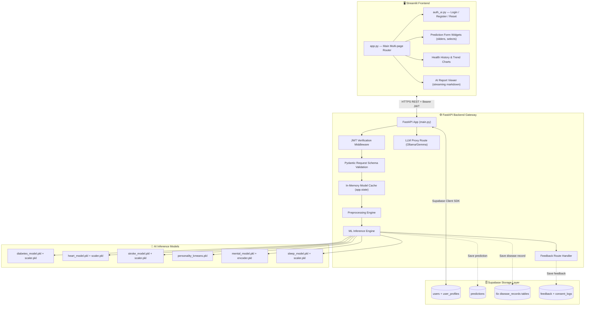
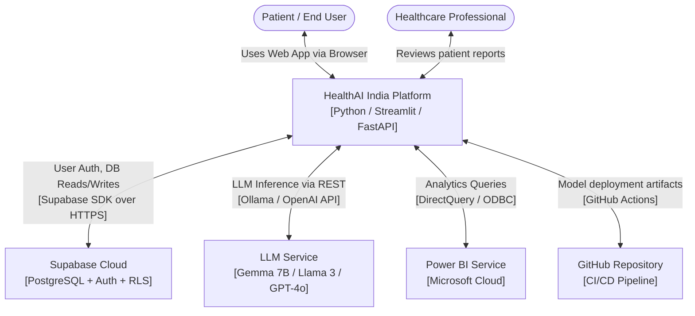
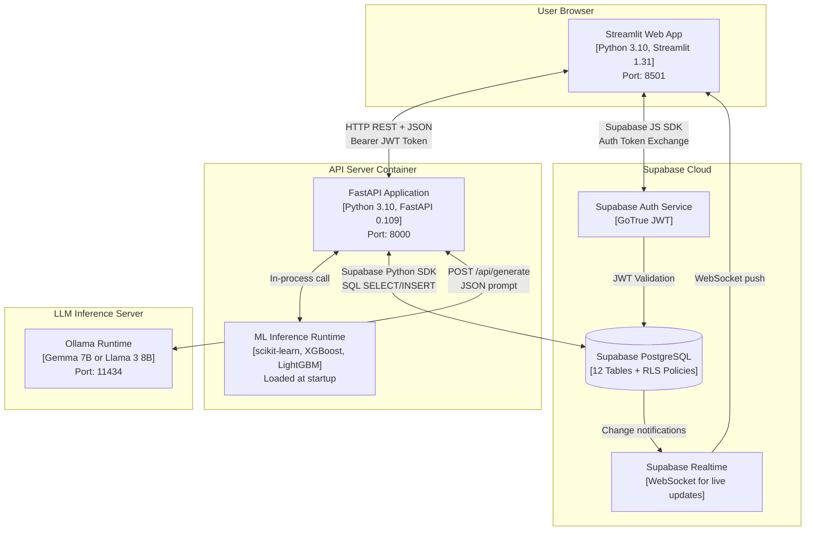
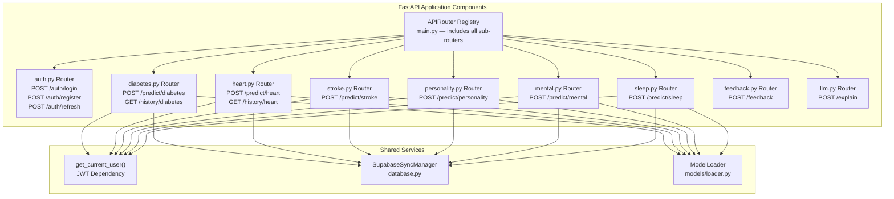
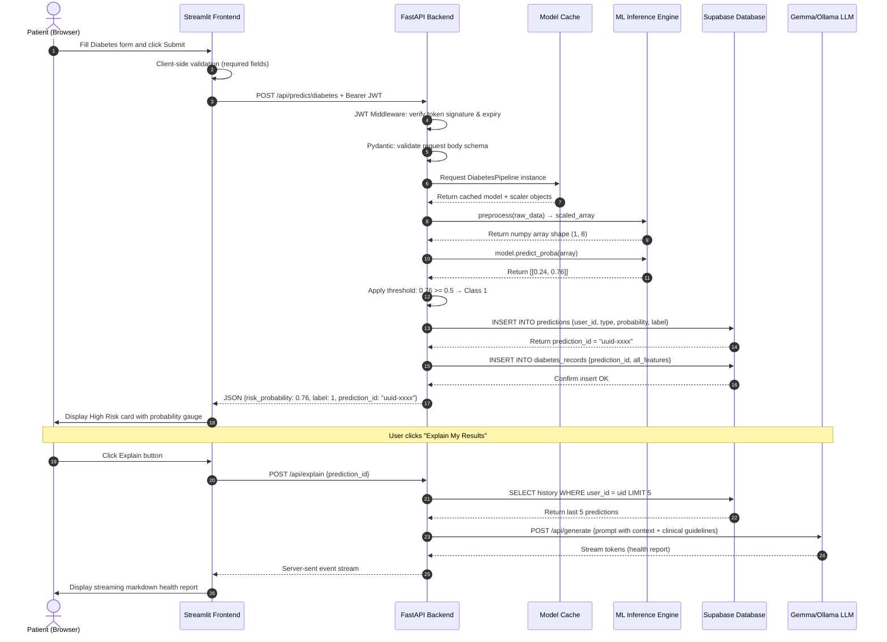
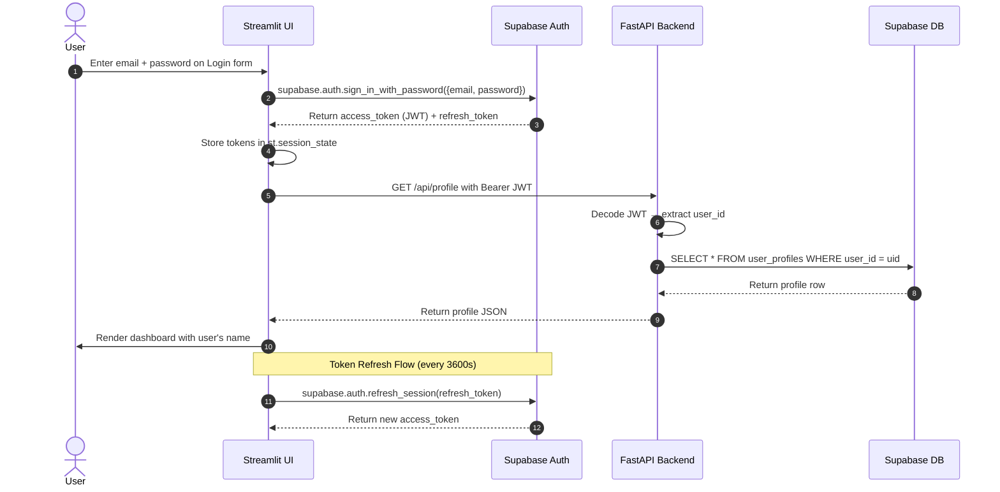
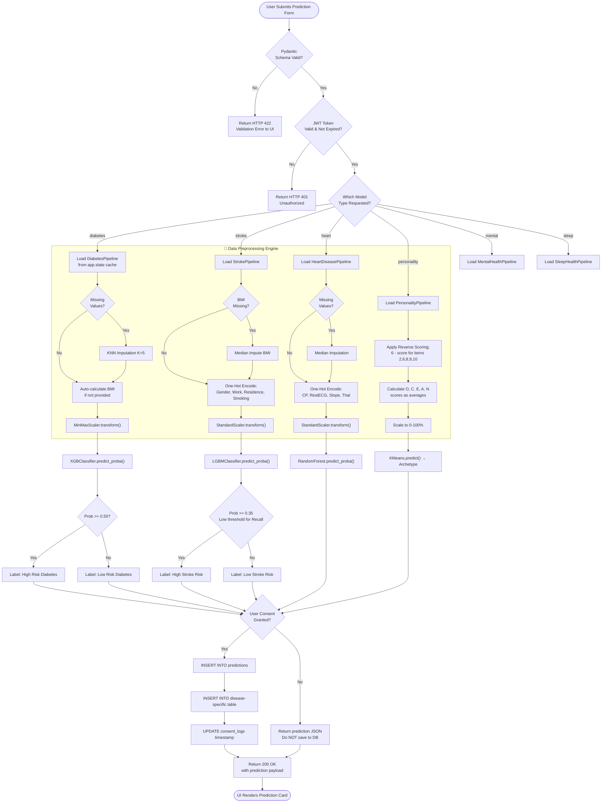

# 🛠️ Technical Requirements Document (TRD) — HealthAI India

This document defines the full system architecture, C4 models, interaction sequences, data pipeline logic, API specifications, and security constraints.

---

## 🏗️ 1. System Architecture & Block Diagram

HealthAI India uses a decoupled, three-tier architecture: Streamlit frontend → FastAPI gateway → Supabase cloud database, with an AI Inference Engine as a co-located service.

---

## 🎛️ 2. C4 Architecture Diagrams

### C4 Level 1 — System Context

Shows the entire HealthAI India system as a black box with its external actors and integrations:

---

### C4 Level 2 — Container Diagram

Shows the individual deployable units inside HealthAI India:

---

### C4 Level 3 — Component Diagram (FastAPI Backend)

Internal component breakdown of the FastAPI application:

---

## 🔄 3. Interaction Sequence Diagrams

### 3.1 Full Prediction Request Flow

---

### 3.2 User Authentication Sequence

---

## 📈 4. Advanced Prediction Lifecycle Flowchart

Complete logic covering validation, preprocessing branching, inference, threshold decisions, DB transactions, and error handling:

---

## 🔒 5. Security & Performance Constraints

### Authentication & Authorization
- All `/api/predict/*` and `/api/history/*` routes require a `Bearer <JWT>` token issued by Supabase Auth.
- Supabase RLS enforces `user_id = auth.uid()` on every table — no cross-user data leakage is possible at the DB layer.
- FastAPI `Depends(get_current_user)` dependency injects the verified user on every protected route.
- Tokens expire after 3600 seconds; refresh tokens are rotated on every refresh.

### Performance Requirements

| Constraint | Target | Implementation |
|:---|:---:|:---|
| ML Inference Latency | ≤ 100ms | Models cached in `app.state` on startup |
| API Round-trip (predict) | ≤ 350ms | Async DB writes using `BackgroundTasks` |
| LLM First Token | ≤ 1.5s | Streaming via Server-Sent Events |
| Concurrent Users | 100+ | Uvicorn `--workers 4` + async endpoints |
| DB Query Time | ≤ 50ms | Indexed on `user_id` and `created_at` |
