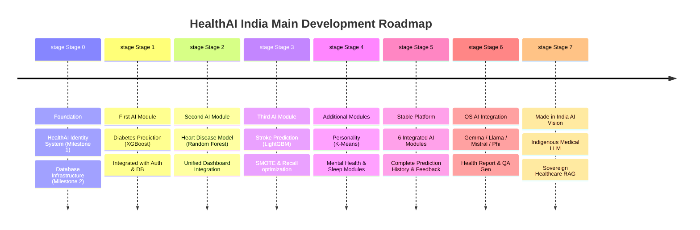
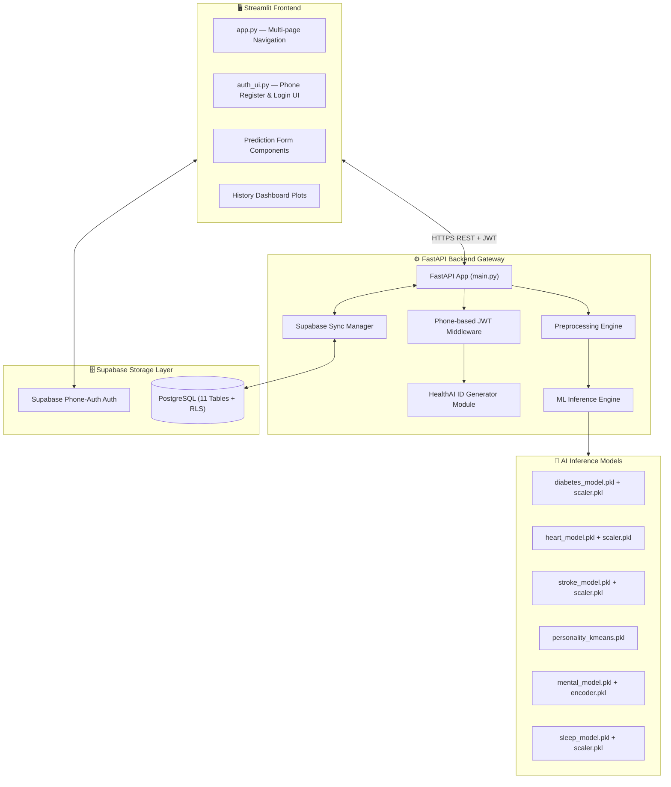
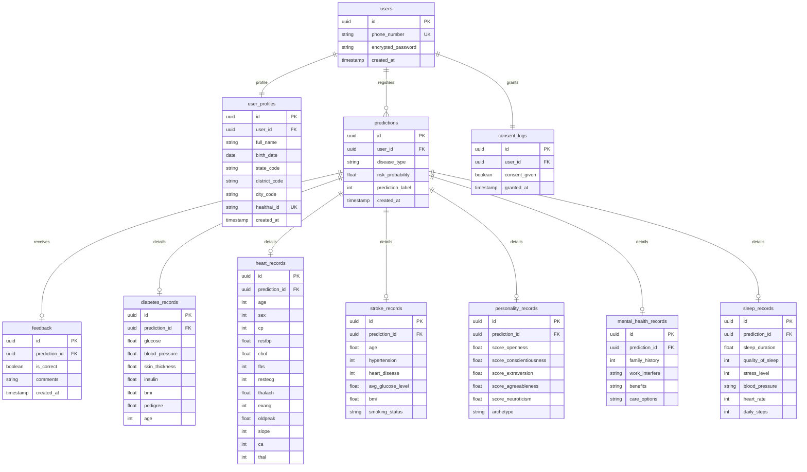
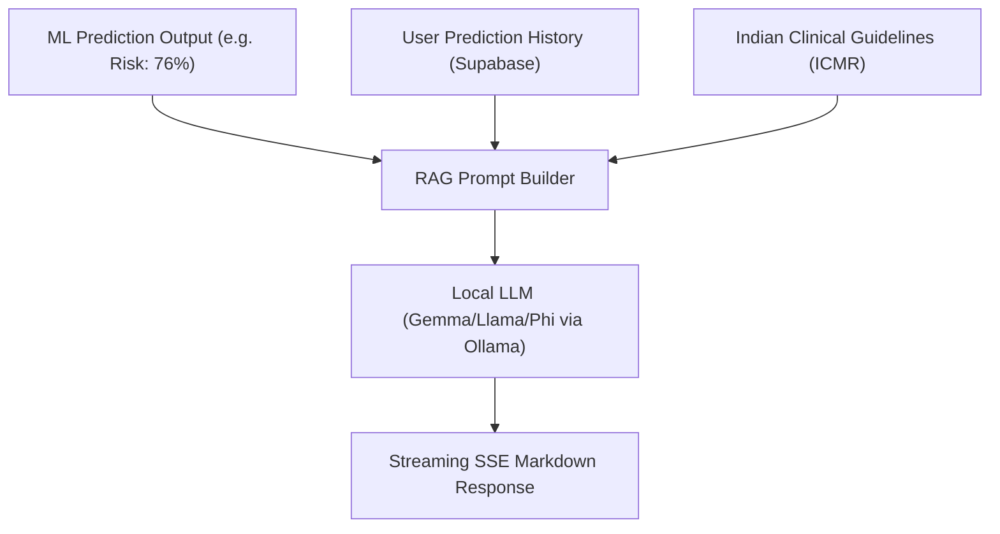

# 🛠️ Technical Requirements Document (TRD) — HealthAI India

This document defines the complete technical architecture, C4 container structures, database schema definitions, authentication frameworks, API specifications, and performance parameters for HealthAI India.

---

## 📌 Table of Contents

1. [Executive Development Roadmap](#-1-executive-development-roadmap)
2. [System Architecture & Container Design](#-2-system-architecture--container-design)
3. [Folder Structure](#-3-folder-structure)
4. [Authentication & HealthAI ID Generation Architecture](#-4-authentication--healthai-id-generation-architecture)
5. [Supabase Database Schema Design](#-5-supabase-database-schema-design)
6. [Machine Learning Pipeline Architecture](#-6-machine-learning-pipeline-architecture)
7. [API Gateway Contracts](#-7-api-gateway-contracts)
8. [Incremental Integration Strategy](#-8-incremental-integration-strategy)
9. [Future LLM & RAG Architecture (Stage 6/7)](#-9-future-llm--rag-architecture-stage-67)
10. [Security & Performance Benchmarks](#-10-security--performance-benchmarks)

---

## 🏁 1. Executive Development Roadmap

The platform follows a structured development pipeline:



### Stage 0 — Foundation
* **Milestone 1 — HealthAI Identity System**: Establish State, District, and City mapping codes. Define the unique geographical HealthAI ID structure: `StateCode-DistrictCode-CityCode-Sequence` (e.g. `WB-01-0001-XXXXX`).
* **Milestone 2 — Database Infrastructure**: Create database tables in Supabase (with Row Level Security enabled). Build registration and login APIs. Users can sign up (State -> District -> City -> Phone -> Name -> DOB -> Password -> ID Generation -> Account Created), log in, and view their blank dashboard.

### Stage 1 — First AI Module
* Train and integrate the Diabetes Prediction (XGBoost) engine. Build backend pipelines and Streamlit form widgets.

### Stage 2 — Second AI Module
* Train, test, and integrate the Heart Disease (Random Forest) engine. Add navigation card and prediction history plots.

### Stage 3 — Third AI Module
* Train, evaluate, and integrate the Stroke Prediction (LightGBM + SMOTE) model using a custom recall-optimized threshold of 0.35.

---

## 🎨 2. System Architecture & Container Design

HealthAI India uses a decoupled, three-tier architecture: Streamlit Frontend, FastAPI Gateway, and Supabase Cloud.



---

## 🗂️ 3. Folder Structure

```text
HealthAI/
├── backend/                          # FastAPI Gateway
│   ├── main.py                       # Application Entrypoint
│   ├── database.py                   # SupabaseSyncManager Class
│   ├── dependencies.py               # JWT Verification (Phone-based)
│   ├── config.py                     # Environment variables
│   ├── routes/                       # APIRouters
│   │   ├── auth.py                   # User registration and phone login
│   │   ├── diabetes.py               # Diabetes predict & history routes
│   │   ├── heart.py                  # Heart predict & history routes
│   │   ├── stroke.py                 # Stroke predict & history routes
│   │   ├── personality.py            # Personality predict & history routes
│   │   ├── mental.py                 # Mental Health predict & history routes
│   │   ├── sleep.py                  # Sleep Health predict & history routes
│   │   └── feedback.py               # User feedback route
│   ├── schemas/                      # Pydantic schemas
│   └── pipelines/                    # ML Pipeline models
├── frontend/                         # Streamlit Frontend
│   ├── app.py                        # App entry point
│   ├── auth_ui.py                    # Login & registration screens
│   ├── config.py                     # API client settings
│   ├── pages/                        # Individual disease pages
│   └── components/                   # Shared UI modules (charts, cards)
└── database/                         # SQL Schemas and RLS migrations
```

---

## 🔑 4. Authentication & HealthAI ID Generation Architecture

### Authentication
* **Primary Key/Identifier**: User phone number.
* **Flow**:
  1. Signup: Client posts location metadata, phone number, full name, DOB, and password.
  2. The backend generates the unique HealthAI ID.
  3. The backend inserts the user profile into Supabase and returns a successful response.
  4. Login: The client posts phone number and password. Supabase verifies and returns a JWT access token.
  5. Subsequent requests pass the JWT in the `Authorization: Bearer <token>` header.

### HealthAI ID Generation
Upon signup, the backend constructs the ID using:
```text
StateCode - DistrictCode - CityCode - Sequence
```
* **State/District/City Codes**: Looked up from geographical configuration parameters.
* **Sequence**: Generated dynamically by the database sequence or sequence algorithm in the backend.
* *Note: The specific codebooks and database locking algorithms for high-concurrency sequencing are future development tasks. The TRD establishes the identifier length, format, storage constraints, and indexing.*

---

## 🗄️ 5. Supabase Database Schema Design

The PostgreSQL database enforces relational integrity, with Row Level Security (RLS) enabled on all patient-facing tables.



---

## 🤖 6. Machine Learning Pipeline Architecture

In Stage 1, all predictions are built on Python tabular models loaded into memory on server initialization:

```text
Input JSON -> Pydantic Validation -> Preprocessing -> Model Inference -> Postprocessing Output
```

1. **Preprocessing**: Missing value handling via `KNNImputer` or median imputation, categorical scaling via `OneHotEncoder`, and normalization via `StandardScaler` / `MinMaxScaler`.
2. **Inference**: Traditional ML classifiers run in-process:
   - *Diabetes*: XGBoost Classifier.
   - *Heart*: Random Forest Classifier.
   - *Stroke*: LightGBM + SMOTE, Custom decision threshold of 0.35.
   - *Personality*: K-Means Clustering (k=4).
   - *Mental Health*: Random Forest.
   - *Sleep*: Multi-class XGBoost.

---

## 🌐 7. API Gateway Contracts

### 1. User Registration
* **Endpoint**: `POST /api/auth/register`
* **Request Body**:
```json
{
  "state_code": "WB",
  "district_code": "01",
  "city_code": "0001",
  "phone_number": "+919876543210",
  "full_name": "Raj Kumar",
  "birth_date": "1984-06-15",
  "password": "SecurePassword123"
}
```
* **Response Body (201 Created)**:
```json
{
  "status": "success",
  "healthai_id": "WB-01-0001-00001",
  "message": "Account created successfully"
}
```

### 2. User Login
* **Endpoint**: `POST /api/auth/login`
* **Request Body**:
```json
{
  "phone_number": "+919876543210",
  "password": "SecurePassword123"
}
```
* **Response Body (200 OK)**:
```json
{
  "access_token": "eyJhbGciOi...",
  "token_type": "bearer",
  "healthai_id": "WB-01-0001-00001"
}
```

### 3. Diabetes Prediction (Authenticated)
* **Endpoint**: `POST /api/predict/diabetes`
* **Headers**: `Authorization: Bearer <JWT>`
* **Request Body**:
```json
{
  "glucose": 148.0,
  "blood_pressure": 72.0,
  "skin_thickness": 35.0,
  "insulin": 0.0,
  "height_cm": 175.0,
  "weight_kg": 80.0,
  "pedigree_function": 0.627,
  "age": 42
}
```
* **Response Body (200 OK)**:
```json
{
  "prediction_id": "8f2a1b9c-e3f4-41d6-8a0e-cf2958361048",
  "risk_probability": 0.764,
  "risk_label": 1,
  "risk_category": "High Risk"
}
```

---

## 📐 8. Incremental Integration Strategy

The FastAPI backend routes are registered sequentially as new models are finalized:

```text
Version 1: auth.py router + database.py (Supabase) + diabetes.py router
Version 2: [Version 1 Routers] + heart.py router
Version 3: [Version 2 Routers] + stroke.py router
... until all 6 routers are unified.
```

---

## 🧠 9. Future LLM & RAG Architecture (Stage 6/7)

When Stage 6 is initiated, the LLM module runs adjacent to the ML prediction pipeline to translate data vectors into natural language health reports.



* **Complemented, Not Replaced**: Traditional ML classifiers remain the deterministic prediction engines. The LLM serves exclusively to explain and summarize results.
* **Retrieval-Augmented Generation (RAG)**: Connects database history tables with local vector stores housing Indian clinical guidelines, preventing LLM hallucinations.

---

## 🔒 10. Security & Performance Benchmarks

* **Row Level Security**: All PostgreSQL SELECT/INSERT statements enforce:
  `user_id = auth.uid()`
* **Inference Latency**: All Scikit-Learn, XGBoost, and LightGBM models are pre-cached in memory on FastAPI application startup, maintaining prediction return speeds under 100ms.
* **Token Expiry**: JWT access tokens are signed using HS256 with a 3600-second expiration window.
