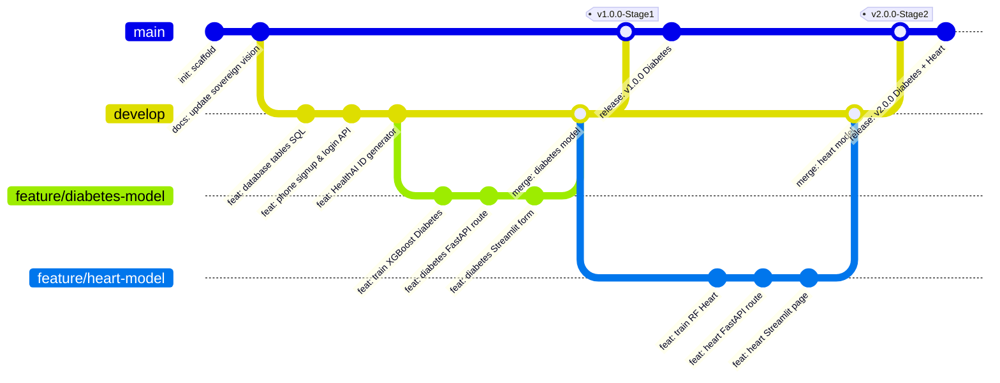

# 🚀 Usage & Deployment Guide — HealthAI India

This guide covers local development setup, database migrations, testing pipelines, Docker containerization, and cloud deployment procedures for HealthAI India.

---

## 📌 Table of Contents

1. [Git Branching & Release History](#-1-git-branching--release-history)
2. [Local Development Setup](#-2-local-development-setup)
3. [Supabase Database Configuration](#-3-supabase-database-configuration)
4. [Testing Pipeline](#-4-testing-pipeline)
5. [Docker Containerization](#-5-docker-containerization)
6. [CI/CD & Cloud Deployment Pipelines](#-6-cicd--cloud-deployment-pipelines)

---

## 🌳 1. Git Branching & Release History

HealthAI India uses **GitFlow** branching. Development happens on feature branches, merges into `develop`, and releases into `main`.



---

## 🛠️ 2. Local Development Setup

### Prerequisites
* Python 3.10+
* [Supabase](https://supabase.com) Project (with API keys and database URL)
* Git + LFS (for ML model binaries)

### Step 1 — Clone and Environment Variables
Clone the repository:
```bash
git clone https://github.com/your-org/HealthAI.git
cd HealthAI
```

Create a `.env` file in the project root:
```env
# Supabase Configuration
SUPABASE_URL=https://your-project-id.supabase.co
SUPABASE_KEY=your-supabase-anon-key
SUPABASE_SERVICE_ROLE_KEY=your-supabase-service-role-key

# FastAPI Configuration
JWT_SECRET=your-supabase-jwt-secret
FASTAPI_URL=http://localhost:8000
```

### Step 2 — Run Backend Server (FastAPI)
```bash
cd backend
python -m venv venv
# On Windows:
venv\Scripts\activate
# On Linux/macOS:
source venv/bin/activate

pip install -r requirements.txt
uvicorn main:app --reload --host 0.0.0.0 --port 8000
```
Interactive API documentation is available at: `http://localhost:8000/docs`

### Step 3 — Run Frontend Client (Streamlit)
```bash
# Open a new terminal window
cd frontend
python -m venv venv
# On Windows:
venv\Scripts\activate
# On Linux/macOS:
source venv/bin/activate

pip install -r requirements.txt
streamlit run app.py
```
Access the web dashboard at: `http://localhost:8501`

---

## 🗄️ 3. Supabase Database Configuration

Run the SQL migration scripts in your Supabase SQL Editor in the following order:

1. **`database/01_users.sql`**: Setup of the standard authentication tables, user profiles table, location mappings, and unique HealthAI ID constraints.
2. **`database/02_predictions.sql`**: Setup of the general prediction logging structures and user consent logs.
3. **`database/03_disease_records.sql`**: Schema for the 6 disease-specific clinical record tables:
   * `diabetes_records`
   * `heart_records`
   * `stroke_records`
   * `personality_records`
   * `mental_health_records`
   * `sleep_records`
4. **`database/04_feedback.sql`**: Schema for user feedback classification logs.
5. **`database/05_rls_policies.sql`**: Configures PostgreSQL Row Level Security (RLS) policies enforcing `user_id = auth.uid()` on all records, restricting access strictly to authenticated profile owners.

---

## 🧪 4. Testing Pipeline

Tests are divided into unit, integration, and E2E suites:

```bash
# Run backend test suite
cd backend
pytest tests/ -v --cov=.
```

* **Unit Tests**: Check local data preprocess operations, scaler transformations, and imputation.
* **Integration Tests**: Verify authentication middleware validations, signup API requests, profile registration outputs, and FastAPI route responses.
* **E2E Tests**: Test full registration workflows (location selection -> phone confirmation -> HealthAI ID generation -> login -> prediction submission -> dashboard updates).

---

## 🐳 5. Docker Containerization

To run the full stack locally via Docker containers:

### Multi-Container Orchestration (`docker-compose.yml`)
```yaml
version: '3.8'

services:
  backend:
    build:
      context: ./backend
      dockerfile: Dockerfile
    container_name: healthai-backend
    ports:
      - "8000:8000"
    environment:
      - SUPABASE_URL=${SUPABASE_URL}
      - SUPABASE_KEY=${SUPABASE_KEY}
      - JWT_SECRET=${JWT_SECRET}
    volumes:
      - ./models:/app/models:ro
    restart: unless-stopped

  frontend:
    build:
      context: ./frontend
      dockerfile: Dockerfile
    container_name: healthai-frontend
    ports:
      - "8501:8501"
    environment:
      - FASTAPI_URL=http://backend:8000
      - SUPABASE_URL=${SUPABASE_URL}
      - SUPABASE_KEY=${SUPABASE_KEY}
    depends_on:
      - backend
    restart: unless-stopped
```

Build and run:
```bash
docker-compose up --build -d
```

---

## ☁️ 6. CI/CD & Cloud Deployment Pipelines

### CI/CD Pipeline (GitHub Actions)
On every pull request to `develop` or push to `main`, the CI workflow:
1. Installs Python dependencies.
2. Lints code using `flake8`.
3. Executes unit and integration tests.
4. Builds Docker images and publishes them to the registry.

### Railway Deployment (Production)
1. Link your GitHub repository in the **Railway Dashboard**.
2. Add a service pointing to `/backend` (Railway auto-detects the Dockerfile and exposes port 8000).
3. Add a service pointing to `/frontend` (Exposes port 8501).
4. Configure env variables in the Railway dashboard. Set `FASTAPI_URL` of the frontend to the public backend domain generated by Railway.
5. Deploys are triggered automatically upon pushes to the production branch.
