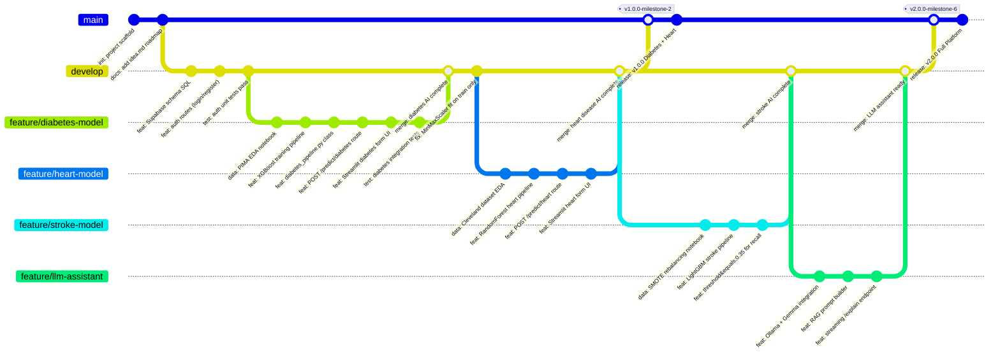
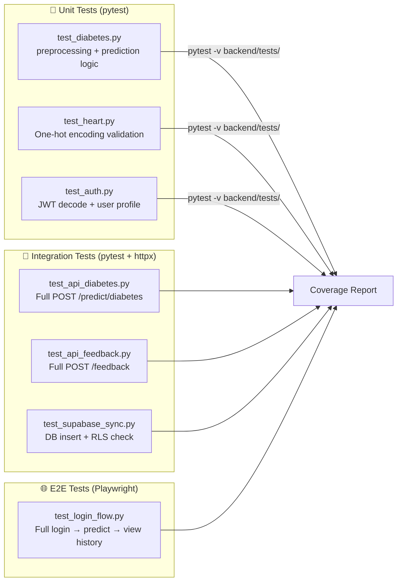
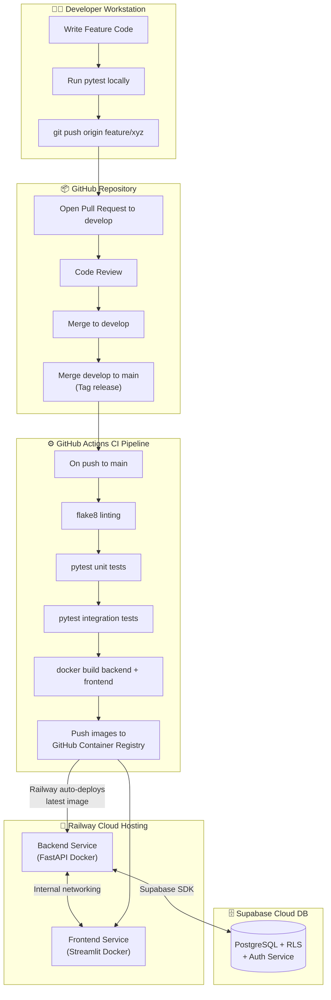

# 🚀 Usage & Deployment Guide — HealthAI India

This guide covers local development, testing, Docker containerization, CI/CD pipelines, and production cloud deployment on Railway or Render.

---

## 🌳 1. Git Branching Strategy & Release History

HealthAI India uses a **GitFlow** branching strategy. All features are developed in isolated branches, tested, then merged into `develop` and released to `main`.



---

## 🛠️ 2. Local Development Setup

### Prerequisites
- Python 3.10+
- pip + virtualenv
- A [Supabase](https://supabase.com) project (free tier works)
- [Ollama](https://ollama.ai) installed for local LLM (optional)

### Step 1 — Clone & Configure Environment

```bash
git clone https://github.com/your-org/HealthAI.git
cd HealthAI
```

Create a `.env` file in the project root:

```env
# Supabase Config
SUPABASE_URL=https://your-project-id.supabase.co
SUPABASE_KEY=your-supabase-anon-key
SUPABASE_SERVICE_ROLE_KEY=your-service-role-key

# FastAPI Config
JWT_SECRET=your-supabase-jwt-secret
FASTAPI_URL=http://localhost:8000

# LLM Config (optional)
OLLAMA_URL=http://localhost:11434
LLM_MODEL=gemma:7b
```

### Step 2 — Set Up Supabase Database

```bash
# Run SQL migrations in Supabase SQL Editor (in order):
# 1. database/01_users.sql
# 2. database/02_predictions.sql
# 3. database/03_disease_records.sql
# 4. database/04_feedback.sql
# 5. database/05_rls_policies.sql
```

### Step 3 — Install Backend & Run FastAPI

```bash
cd backend
python -m venv venv
# Windows:
venv\Scripts\activate
# Linux/Mac:
source venv/bin/activate

pip install -r requirements.txt

# Start server with auto-reload
uvicorn main:app --reload --host 0.0.0.0 --port 8000
```

FastAPI interactive docs available at: `http://localhost:8000/docs`

### Step 4 — Install Frontend & Run Streamlit

```bash
# Open a second terminal
cd frontend
python -m venv venv
venv\Scripts\activate  # Windows

pip install -r requirements.txt

streamlit run app.py
```

Streamlit app available at: `http://localhost:8501`

### Step 5 — Pull & Run Local LLM (Optional)

```bash
# Install Ollama from https://ollama.ai then:
ollama pull gemma:7b
ollama serve
# Runs at http://localhost:11434
```

---

## 🧪 3. Testing Pipeline



Run tests:

```bash
# Unit + integration tests
cd backend
pytest tests/ -v --cov=. --cov-report=html

# View coverage report
open htmlcov/index.html
```

---

## 🐳 4. Docker Containerization

### Backend Dockerfile (`backend/Dockerfile`)

```dockerfile
FROM python:3.10-slim

WORKDIR /app

# Install dependencies first (layer caching)
COPY requirements.txt .
RUN pip install --no-cache-dir -r requirements.txt

# Copy models directory (large files via Git LFS)
COPY ../models/ /app/models/

# Copy app source
COPY . .

EXPOSE 8000
CMD ["uvicorn", "main:app", "--host", "0.0.0.0", "--port", "8000", "--workers", "4"]
```

### Frontend Dockerfile (`frontend/Dockerfile`)

```dockerfile
FROM python:3.10-slim

WORKDIR /app

COPY requirements.txt .
RUN pip install --no-cache-dir -r requirements.txt

COPY . .

EXPOSE 8501
HEALTHCHECK CMD curl --fail http://localhost:8501/_stcore/health || exit 1
CMD ["streamlit", "run", "app.py", \
     "--server.port=8501", \
     "--server.address=0.0.0.0", \
     "--server.headless=true"]
```

### Multi-Container Orchestration (`docker-compose.yml`)

```yaml
version: '3.8'

services:
  backend:
    build:
      context: ./backend
      dockerfile: Dockerfile
    container_name: healthai-backend
    ports:
      - "8000:8000"
    environment:
      - SUPABASE_URL=${SUPABASE_URL}
      - SUPABASE_KEY=${SUPABASE_KEY}
      - JWT_SECRET=${JWT_SECRET}
      - OLLAMA_URL=http://ollama:11434
    volumes:
      - ./models:/app/models:ro
    depends_on:
      - ollama
    restart: unless-stopped

  frontend:
    build:
      context: ./frontend
      dockerfile: Dockerfile
    container_name: healthai-frontend
    ports:
      - "8501:8501"
    environment:
      - FASTAPI_URL=http://backend:8000
      - SUPABASE_URL=${SUPABASE_URL}
      - SUPABASE_KEY=${SUPABASE_KEY}
    depends_on:
      - backend
    restart: unless-stopped

  ollama:
    image: ollama/ollama:latest
    container_name: healthai-ollama
    ports:
      - "11434:11434"
    volumes:
      - ollama_data:/root/.ollama
    restart: unless-stopped

volumes:
  ollama_data:
```

```bash
# Build and launch all services
docker-compose up --build -d

# Pull the LLM model into the ollama container
docker exec healthai-ollama ollama pull gemma:7b

# View logs
docker-compose logs -f backend
```

---

## ☁️ 5. CI/CD & Cloud Deployment Pipeline



### Railway Deployment Steps

1. Go to [railway.app](https://railway.app) → **New Project** → **Deploy from GitHub**
2. Add **Backend Service**: set Root Directory to `/backend`, auto-detects Dockerfile.
3. Add **Frontend Service**: set Root Directory to `/frontend`.
4. Set environment variables in Railway dashboard for each service.
5. Railway auto-assigns public URLs with SSL. Copy the backend URL into the frontend's `FASTAPI_URL` variable.
6. Enable **Auto-Deploy on push to main** in Railway settings.

### Health Check Endpoints

```
GET http://your-backend-url/health
→ {"status": "ok", "models_loaded": 6, "db_connected": true}
```
