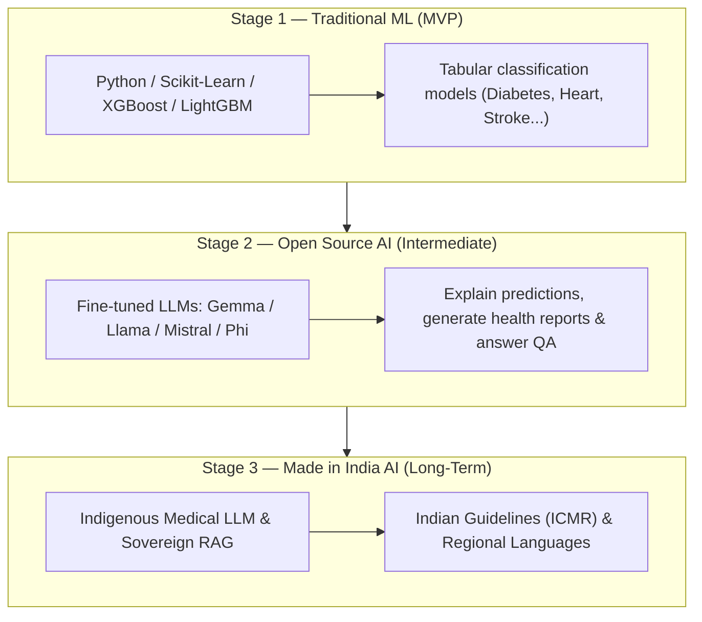

# 🏥 HealthAI India — Project Idea Document

> **Building a Made in India Healthcare AI Ecosystem**
>
> An indigenous AI-powered preventive healthcare platform that evolves from a single-disease prediction tool into a comprehensive, self-sustaining healthcare intelligence ecosystem — built in India, for India.

---

## 📌 Table of Contents

1. [Problem Statement](#-problem-statement)
2. [Why India Needs This](#-why-india-needs-this)
3. [Overall Vision: Architectural Segmentation](#-overall-vision-architectural-segmentation)
4. [What HealthAI India Is & Is NOT](#-what-healthai-india-is--is-not)
5. [Core Philosophy](#-core-philosophy)
6. [HealthAI Identity System](#-healthai-identity-system)
7. [Authentication & Registration Flows](#-authentication--registration-flows)
8. [Machine Learning Roadmap (Three-Stage)](#-machine-learning-roadmap-three-stage)
9. [Development Strategy — Incremental Integration](#-development-strategy--incremental-integration)
10. [Repository Evolution](#-repository-evolution)
11. [Differentiators & Impact](#-differentiators--impact)
12. [Open Source & Community](#-open-source--community)

---

## 🔴 Problem Statement

India faces a **dual healthcare crisis**:

1. **Acute shortage of healthcare professionals** — India has approximately 1 doctor per 1,511 citizens (WHO recommends 1:1,000). Preventive screening is a luxury, not a standard, especially in rural and semi-urban areas.
2. **Late detection of chronic diseases** — Over 77 million Indians are diabetic, yet nearly 57% remain undiagnosed. Heart disease accounts for nearly 28% of all deaths in India. Stroke incidence is rising at alarming rates among younger populations.
3. **Mental health crisis in silence** — Over 197 million Indians need mental health support, yet fewer than 30 million seek or receive help. Sleep disorders and workplace burnout are escalating but remain critically underserved.
4. **Dependence on foreign AI infrastructure** — Healthcare AI tools available in India are predominantly built on foreign models, foreign data, and foreign infrastructure. There is no comparable indigenous platform designed around Indian clinical guidelines, Indian epidemiological data, and Indian languages.

**The gap is clear:** India needs an accessible, AI-powered health screening platform that combines **secure user identity** with clinical-grade predictions — and one that is built from the ground up in India.

---

## 🇮🇳 Why India Needs This

| Factor | Current Reality in India | What This Project Addresses |
|:---|:---|:---|
| **Accessibility** | 65% of Indians lack access to preventive health screening | Free, web-based AI health predictions with simple phone-number-based registration |
| **Affordability** | Preventive health checkups cost ₹2,000–₹8,000 | Free, open-source, web-based health assessments |
| **Awareness** | Most Indians discover conditions at advanced stages | Early risk detection through ML-powered screening |
| **Identity** | No unified personal health identity for common citizens | Unique HealthAI ID — a permanent healthcare identity tied to geographical location |
| **Data Sovereignty** | Health data processed by foreign platforms | Indian-built platform storing data in Indian-hosted databases |
| **Language** | Most health AI tools are English-only | Long-term roadmap includes Indian language support |
| **AI Independence** | Healthcare AI is dominated by US/China | Long-term vision: indigenous Indian healthcare LLM |

---

## 🗺️ Overall Vision: Architectural Segmentation

To ensure realistic development and transparent planning, the features of HealthAI India are strictly separated into three distinct horizons.

### 1. MVP (Current Version)
* **Authentication**: Mandatory registration and login using Phone Number (Primary Key) + Password.
* **Identity**: Automatic generation of the permanent, geographical-based HealthAI ID.
* **Dashboard**: User dashboard showing prediction history and health summary.
* **ML Engines**: Traditional machine learning models (Scikit-Learn, XGBoost, LightGBM, CatBoost) running locally or in-process.
* **Database**: Supabase storage for users, profiles, consent logs, prediction history, and feedback.
* **Questionnaires**: 100% human-friendly questionnaires that auto-calculate derived features (e.g. BMI).

### 2. Intermediate Versions
* **Explainable AI**: Integration of local open-source LLMs (Gemma, Llama, Mistral, Phi) to explain predictions in plain, clinician-like language.
* **AI Health Assistant**: Streaming health report generator and conversational assistant built on top of the prediction records.

### 3. Long-Term Vision
* **Sovereign India AI Stack**: Development of an Indigenous Medical LLM trained on local clinical datasets and textbooks.
* **Indian Clinical RAG**: Retrieval-Augmented Generation using the Indian Medical Knowledge Base and ICMR guidelines.
* **Multilingualism**: Native support for major Indian regional languages (Hindi, Bengali, Tamil, Telugu, etc.).
* **Continuous Retraining**: Secure, privacy-preserving, consent-based pipeline to retrain models on local Indian populations.

---

## 💡 What HealthAI India Is & Is NOT

### What It Is
* A **preventive healthcare screening platform** utilizing machine learning to assess risk levels.
* A **secure, identity-first system** where every user registers with a phone number and is assigned a unique HealthAI ID.
* A **longitudinal health tracker** storing prediction records over time in a secure database.
* A **human-friendly experience** asking clear, clinical questions without exposing database column names.
* An **incremental open-source product** designed to evolve stage-by-stage.

### What It Is NOT
* ❌ **Not a diagnostic tool** — Risk predictions do not constitute a medical diagnosis.
* ❌ **Not a telemedicine platform** — It does not connect users directly to doctors or write prescriptions.
* ❌ **Not an anonymous platform** — User authentication is a mandatory requirement from Day 1 to track health history.
* ❌ **Not a replacement for clinicians** — It serves as an early-warning screening tool, complementing professional care.

---

## 🎯 Core Philosophy

### Identity First, Secure Access
Every user has a verified, secure account. Authentication is a core requirement of the application, serving as the gateway to the dashboard and the prediction modules. The phone number serves as the primary unique identifier.

### Human-First Questionnaires
Questions are asked in plain, understandable language. Technical metrics such as BMI are calculated automatically from basic inputs (Height & Weight), ensuring no technical or dataset-specific terminology is ever exposed to the user.

### Incremental Integration
Never build all AI models in isolation first. The project integrates one module at a time (Database -> Auth -> Diabetes -> Test -> Integrate -> Heart Disease -> Test -> Integrate...). Every phase concludes with a fully working, deployable production build.

---

## 🪪 HealthAI Identity System

Upon successful registration, the backend automatically generates a **unique HealthAI ID**. This ID serves as the user's permanent, structured healthcare identity inside the ecosystem.

### ID Format
```text
WB-01-0001-XXXXX
│  │  │    │
│  │  │    └── Sequential User Identifier (generated by backend)
│  │  └─────── City Code
│  └────────── District Code
└───────────── State Code
```

### Architectural Role
* **Permanent Identity**: Stored in the `user_profiles` table and linked as a foreign key to prediction tables.
* **Geographical Mapping**: Enables regional analysis of disease vectors (e.g. tracking heart disease risk distribution at the district level).
* **Automatic Generation**: Instantly generated during the signup flow once the location parameters (State -> District -> City) are defined.
* **Algorithm Status**: The detailed generation algorithm, sequence synchronization, and optimization are future development tasks. The current MVP documents and establishes the identity schema, metadata structure, and primary key workflows.

---

## 🔑 Authentication & Registration Flows

The registration and login workflow is strictly structured as follows:

### 1. Registration Flow
```text
State Selection
      ↓
District Selection
      ↓
City Selection
      ↓
Phone Number (Primary Key)
      ↓
Full Name
      ↓
Date of Birth
      ↓
Password
      ↓
Confirm Password
      ↓
Generate Unique HealthAI ID (Backend)
      ↓
Account Created successfully
```

### 2. Login Flow
Returning users access the application using:
* **Phone Number**
* **Password**

*Note: No email or username login is supported. Phone number serves as the primary, unique identity.*

---

## 🤖 Machine Learning Roadmap (Three-Stage)

To build a reliable sovereign AI ecosystem, the machine learning capabilities are structured into three distinct stages:



### Stage 1 — Traditional Machine Learning (MVP)
* **Scope**: Powers the 6 physiological and psychological risk prediction engines.
* **Libraries**: Scikit-Learn, Pandas, NumPy, XGBoost, LightGBM, and CatBoost.
* **Goal**: Highly accurate, fast, and low-latency predictions on tabular clinical data.

### Stage 2 — Open Source AI (Intermediate Version)
* **Scope**: Fine-tuning open-source LLMs (Gemma, Llama, Mistral, Phi) to act as the explanation and communication layer.
* **Goal**: Provide user-friendly text reports, explanation of predictions, and answer follow-up queries. These models complement the traditional ML models, which remain the core decision engine.

### Stage 3 — Made in India AI (Long-Term Vision)
* **Scope**: Sovereign research vision for Indian healthcare.
* **Goal**: Indigenous Medical LLMs, RAG engines using local knowledge bases, ICMR guidelines integration, and full native support for regional Indian languages.

---

## 📐 Development Strategy — Incremental Integration

We follow the strict sequence of **Incremental Integration**. Every step yields a fully working product before moving to the next.

```mermaid
flowchart LR
    DB["Database (Supabase)"] --> Auth["Authentication"]
    Auth --> Diab["Diabetes AI"]
    Diab --> Test1["Testing & Integration"]
    Test1 --> Heart["Heart Disease AI"]
    Heart --> Test2["Testing & Integration"]
    Test2 --> Stroke["Stroke AI"]
    Stroke --> Test3["Testing & Integration"]
    Test3 --> Next["Remaining AI Modules..."]
```



1. **Database & Auth (Stage 0)**: Connect authentication system with Supabase. Establish the HealthAI ID generation workflow.
2. **Diabetes AI (Stage 1)**: First AI module. Develop, test, integrate, and deploy.
3. **Heart Disease AI (Stage 2)**: Second AI module. Preprocess, train, test, merge, and redeploy.
4. **Stroke AI (Stage 3)**: Third AI module. Rebalance (SMOTE), optimize threshold, test, merge, and redeploy.
5. **Remaining Modules (Stage 4)**: Personality, Mental Health, Sleep Health.
6. **Final Platform (Stage 5)**: Complete stabilized app with all 6 modules.

---

## 📁 Repository Evolution

The repository evolves step-by-step:

### Version 1
* Authentication + Supabase + HealthAI ID + Diabetes AI

### Version 2
* Authentication + Supabase + HealthAI ID + Diabetes + Heart Disease

### Version 3
* Authentication + Supabase + HealthAI ID + Diabetes + Heart Disease + Stroke

### Final Version
* Authentication + Supabase + HealthAI ID + All 6 AI Modules (Diabetes, Heart Disease, Stroke, Personality, Mental Health, Sleep Health) + Prediction History + Dashboard + Feedback

---

## 🏆 Differentiators & Impact

1. **Geographically-Linked Identity**: The HealthAI ID system maps chronic risks across Indian locations.
2. **Frictionless Security**: Phone-based authentication provides secure longitudinal tracking without requiring email addresses.
3. **Clinical Interpretability**: A clear partition between ML classifiers and open-source generative models ensures predictions remain deterministic and explainable.
4. **Data Sovereignty**: Consented health telemetry is retained locally in line with India's Digital Personal Data Protection Act.

---

## 🤝 Open Source & Community

HealthAI India is built as an open-source initiative designed for community contributions, research collaborations, and educational extensions. By keeping the modules isolated and the documentation thorough, developers and clinical researchers can easily add features, refine models, and build localized adapters.
